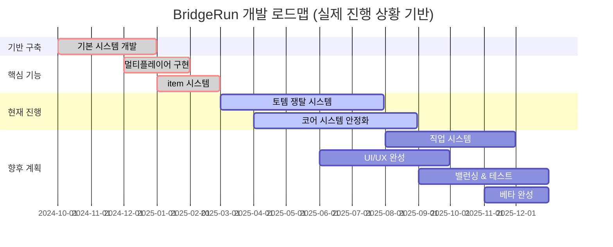

# 🌉 BridgeRun
> **협력으로 다리를 짓고, 경쟁으로 토템을 쟁탈하는 팀 전략 게임**

<div align="center">


**🏗️ BUILD BRIDGES • 🏆 CLAIM TOTEMS • ⚔️ OUTSMART RIVALS**

[](#개발-현황)
[](#개발-현황)
[](#기술-스택)

</div>

---

## 📁 프로젝트 문서 구조

```plaintext
docs/
├── Design/               // 🎨 게임 디자인 문서
│   ├── game-design-document.md    // 전체 게임 설계서
│   ├── character-classes.md       // 5개 직업 상세 가이드  
│   ├── map-and-themes.md         // 안데스 테마, 맵 구조
│   └── balancing-and-rules.md    // 밸런싱 철학
│
├── Development/          // ⚙️ 개발 기술 문서  
│   ├── technical-implementation.md  // 기술적 구현 상세
│   ├── architecture-decisions.md   // 아키텍처 설계 결정
│   └── code-evolution/            // 코드 진화 과정
│
├── Mechanics/           // 🔧 게임 메커니즘 분석
│   ├── building-system.md        // 건설 시스템 분석
│   ├── combat-system.md          // 전투 시스템 분석  
│   └── networking.md             // 네트워킹 구현
│
└── Sprints/             // 📅 스프린트별 개발 기록
    ├── BridgeRun_Sprint1.md      // 각 스프린트별
    ├── BridgeRun_Sprint2.md      // 상세 개발 과정
    └── ...                       // 총 14회차 기록
```

---

## 🎯 게임 개요

**BridgeRun**은 3-4팀이 동시에 경쟁하는 협력 건설 + 토템 쟁탈 게임입니다.

### 🎮 **핵심 게임플레이**
- **팀 구성**: 3-4팀 × 3명 멀티플레이어
- **게임 목표**: 판자로 다리를 건설하여 토템존에 도달, 토템 쟁탈로 점수 획득
- **진행 방식**: 15분 3라운드 승부
- **핵심 메커니즘**: 협력 건설 + 실시간 경쟁

### ⚡ **게임의 재미 요소**
- **협력과 경쟁의 동시 진행**: 팀 내 협력하며 다른 팀과 경쟁
- **실시간 건설/파괴 시스템**: 순간의 판단이 승부를 결정
- **5가지 직업 시스템**: 각자 다른 역할로 전략적 플레이
- **역동적인 게임 흐름**: 건설 → 이동 → 쟁탈 → 방어

---

## 🔧 개발 현황 & 로드맵



### 📊 **현재 상황 (2025년 6월 기준)**
- **개발 시작**: 2024년 10월
- **현재 스프린트**: 14회차 진행 중
- **개발 방식**: 1인 개발 + 외부 협력 (3D 모델링)
- **목표**: 2025년 말 완성도 높은 베타 버전

### ✅ **완료된 주요 기능**

**🏗️ 기반 구축 (2024.10-12)**
- 🎮 기본 캐릭터 이동 및 상호작용 시스템
- 🔨 판자 건설 시스템 (기본 버전)
- 📦 아이템 인벤토리 및 관리 시스템

**⚙️ 핵심 기능 (2024.12-2025.02)**
- 🌐 네트워크 기반 멀티플레이어 (4팀 지원)
- 👥 팀 선택 및 로비 시스템
- 🏆 기본 트로피 시스템 (점수 획득 메커니즘)
- 🔄 서버-클라이언트 동기화 시스템

### 🚧 **현재 개발 중**
- 🎯 토템 쟁탈 메커니즘 고도화
- ⚖️ 게임 밸런싱 및 성능 최적화
- 🎨 UI/UX 시스템 개선
- 🧩 코어 시스템 안정화

### 💭 **구상 완료 (구현 대기)**
- 👷 5가지 직업 시스템 (시민, 건설가, 직물사, 저격수, 러너)

### 📋 **로드맵 설명**
위 차트는 실제 개발 진행 상황을 바탕으로 작성되었습니다. 스프린트 4-12에서 구현된 네트워크 시스템과 아이템 시스템을 기반으로, 현재는 토템 쟁탈 시스템과 코어 시스템 안정화에 집중하고 있습니다. 직업 시스템은 컨셉과 디자인이 완료되었지만 안정적인 구현을 위해 코어 시스템 완성 후 진행할 예정입니다.

---

## ⚙️ 기술 스택

- **게임 엔진**: Unreal Engine 4.27
- **개발 언어**: C++ (기본 로직) + Blueprint (UI/설정)
- **타겟 플랫폼**: PC
- **네트워킹**: 언리얼 전용 서버
- **버전 관리**: Git

---

## 📚 프로젝트 문서

### 🎨 **게임 디자인**
- **[📖 게임 디자인 문서](./docs/Design/game-design-document.md)** - 전체 게임 설계서
- **[👥 캐릭터 직업 시스템](./docs/Design/character-classes.md)** - 5개 직업 상세 가이드
- **[🗺️ 맵 & 테마 디자인](./docs/Design/map-and-themes.md)** - 안데스 테마, 맵 구조
- **[⚖️ 게임 밸런스 가이드](./docs/Design/balancing-and-rules.md)** - 밸런싱 철학

### ⚙️ **개발 문서**
- **[🔧 개발 현황](./docs/Development/)** - 기술적 구현 상세
- **[⚙️ 게임 메커니즘](./docs/Mechanics/)** - 시스템 분석
- **[📅 스프린트 기록](./docs/Sprints/)** - 개발 과정 전체

---

## 🎯 개발 목적

1. **포트폴리오 구축** - 게임 개발 역량 증명
2. **개인 목표 실현** - 게임 개발자로서의 꿈 실현
3. **공모전 도전** - 완성도 달성 시 각종 공모전 출품 예정

---

## 🚀 향후 계획

### **단기 목표 (2025년 상반기)**
- [ ] 5가지 직업 시스템 완성
- [ ] 토템 쟁탈 시스템 구현
- [ ] 기본 UI/UX 완성
- [ ] 내부 플레이테스트

### **중기 목표 (2025년 하반기)**
- [ ] 베타 테스트 진행
- [ ] 게임 밸런싱 완료
- [ ] 공모전 출품
- [ ] 웹사이트 제작

### **장기 목표 (2026년)**
- [ ] 정식 출시 준비
- [ ] 커뮤니티 구축
- [ ] 추가 컨텐츠 개발

---

## 📞 연락처

**개발자**: 김건우  
**이메일**: rjsdn9008@gmail.com

---

<div align="center">

**🔨 현재 열심히 개발 중입니다! 🔨**

*완성되면 데모, 영상, 웹사이트 등 모든 것을 채워나갈 예정입니다.*

</div>
