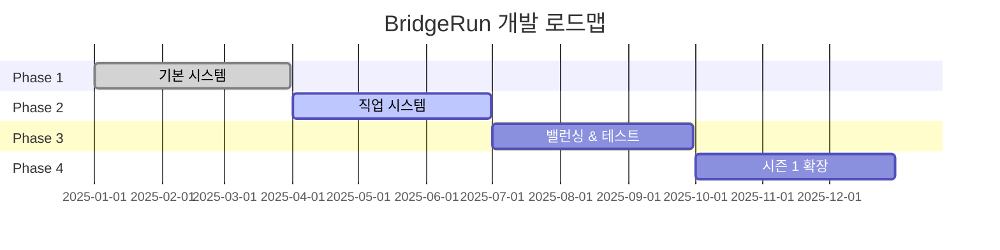

# 🌉 BridgeRun
> **협력으로 다리를 짓고, 경쟁으로 토템을 쟁탈하는 팀 전략 게임**

**🏗️ BUILD BRIDGES** • **🏆 CLAIM TOTEMS** • **⚔️ OUTSMART RIVALS**

---

## 🎯 게임 한눈에 보기

<table>
<tr>
<td width="50%">

### 🏗️ **무엇을 하는 게임인가?**
- **3-4팀 × 3명**이 동시에 경쟁
- **판자로 다리 건설** → 적 팀 방해
- **토템 쟁탈** → 점수 획득
- **15분 3라운드** 승부

### ⚡ **왜 재미있는가?**
- **협력 + 경쟁** 동시 진행
- **실시간 건설/파괴** 역학
- **5가지 직업** 역할 분담
- **순간의 판단**이 승부 결정

</td>
<td width="50%">

*실시간 다리 건설 & 토템 쟁탈 장면*

</td>
</tr>
</table>

---

## 🎮 핵심 시스템 미리보기

| 🔨 **건설 시스템** | 👥 **직업 시스템** | 🏆 **토템 시스템** |
|:---:|:---:|:---:|
|  |  |  |
| 판자 + 텐트로 **전략적 구조물** 건설 | **5가지 직업** 각각 고유 능력 | **3단계 토템** 10점→20점→30점 |

---

## 📊 개발 현황 & 로드맵

**🔥 현재 상태:** 85% 완료 | **🎯 목표:** 2025년 하반기 공개

---

## 🚀 지금 바로 체험하기

### 🎬 **2분 데모 영상**

### 🎮 **플레이어블 데모**
[**▶️ 지금 플레이하기**](플레이링크) | [**📱 모바일 버전**](모바일링크)

---

## 📚 자세한 정보

<strong>🎨 게임 디자인 문서</strong>

- **[📖 전체 게임 디자인](./docs/Design/game-design-document.md)** - 완전한 게임 설계서
- **[👥 캐릭터 직업 시스템](./docs/Design/character-classes.md)** - 5개 직업 상세 가이드  
- **[🗺️ 맵 & 테마 디자인](./docs/Design/map-and-themes.md)** - 안데스 테마, 맵 구조
- **[⚖️ 게임 밸런스 가이드](./docs/Design/balancing-and-rules.md)** - 밸런싱 철학

<strong>⚙️ 기술 문서</strong>

- **[🔧 개발 현황](./docs/Development/)** - 기술적 구현 상세
- **[⚙️ 게임 메커니즘](./docs/Mechanics/)** - 시스템 분석
- **[📅 스프린트 기록](./docs/Sprints/)** - 개발 과정 전체

---

## 🏆 수상 & 인정

---

**💬 문의 & 연락**

📧 **Email**: team@bridgerun.game  
🌐 **Website**: www.bridgerun.game  
💬 **Discord**: BridgeRun 개발팀

---

**⭐ 이 프로젝트가 마음에 드셨다면 Star를 눌러주세요!**

*Built with ❤️ using Unreal Engine 5*

---