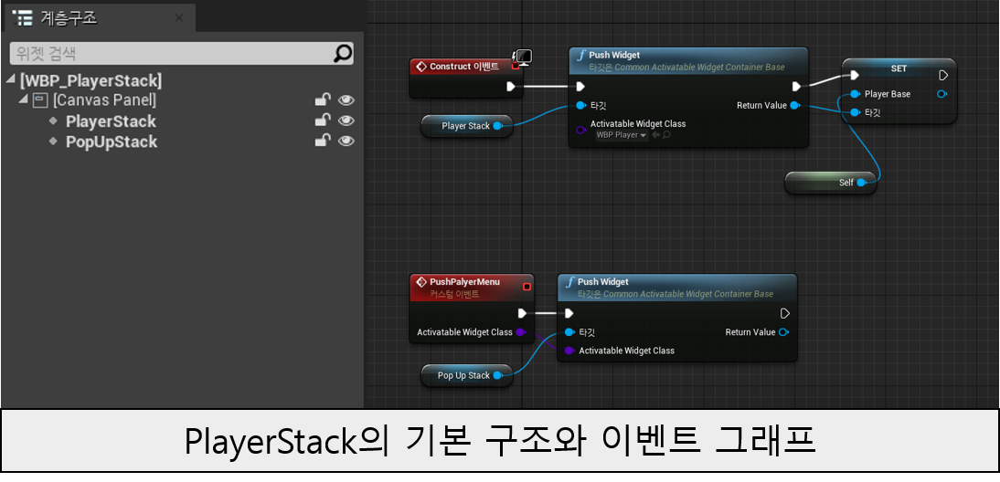
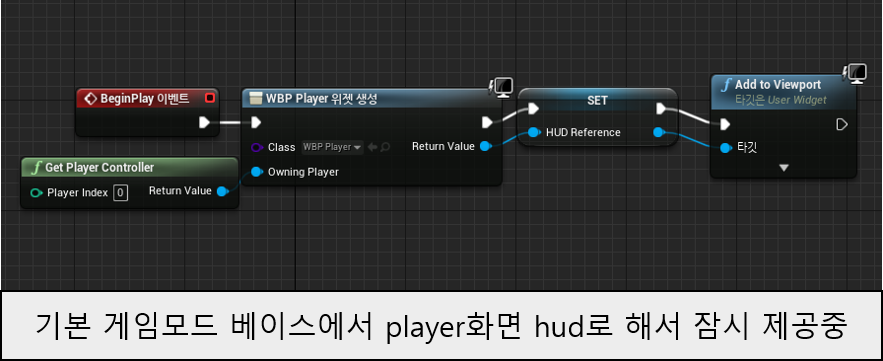
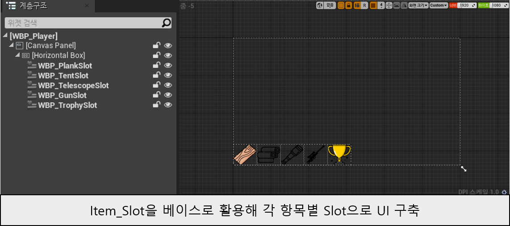
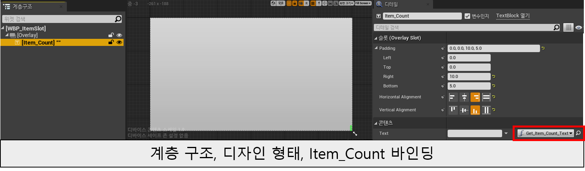
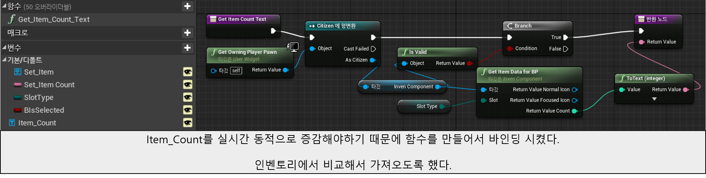
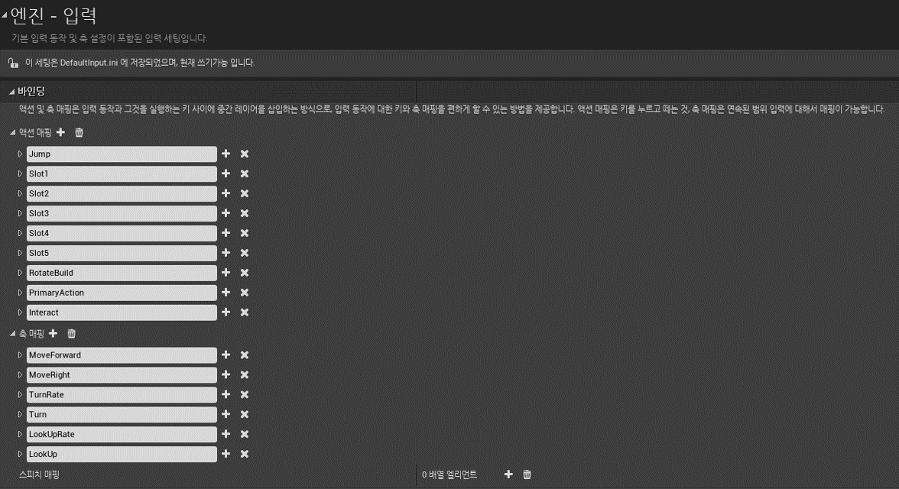
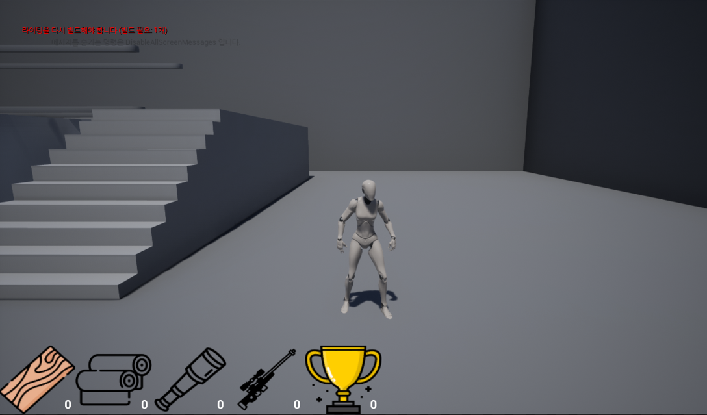

# 브릿지런 개발일지 (1-2주차)

개발일: 2024년 11월 4일 ~ 2024년 11월 17일
작성자: 김건우

## 1. UI 시스템 구현

### 1.1 Common UI를 활용한 PlayerStack 구현

Common UI 플러그인을 활용하여 효율적인 UI 스택 관리 시스템을 구현했습니다.
이전 프로젝트에서의 경험을 바탕으로, UI 스택의 체계적인 관리를 위해 PlayerStack과 PopUpStack으로 구분하여 설계했습니다.
    
1) PlayerStack 구조
   - Canvas Panel을 기본 레이아웃으로 사용
   - PlayerStack: 게임의 기본 UI 관리
   - PopUpStack: 모달 다이얼로그 및 팝업 관리
   
2) 위젯 푸시/팝 시스템
```cpp
// Common UI의 Activatable Widget 기반 구현
void PushPlayerMenu()
{
    if (PlayerStack)
    {
        PlayerStack->AddWidget(CreateWidget<UCommonActivatableWidget>(this, PlayerMenuClass));
    }
}
```

### 1.2 게임모드와 HUD 연동

BeginPlay 이벤트에서 HUD를 초기화하고 플레이어와 연동하는 시스템을 구축했습니다.
```cpp
void AGameModeBase::BeginPlay()
{
    Super::BeginPlay();
    
    // HUD 레퍼런스 설정
    if (WBP_Player)
    {
        HUDReference = CreateWidget<UUserWidget>(GetWorld(), WBP_Player);
        HUDReference->AddToViewport();
    }
}
```

### 1.3 인벤토리 UI 시스템




아이템 카운트의 실시간 업데이트를 위해 바인딩 시스템을 구현했습니다.
InvenComponent에서 아이템 개수가 변경될 때마다 UI가 자동으로 업데이트되도록 설계했습니다.

```cpp
void UInvenComponent::UpdateItemCount(EInventorySlot Slot, int32 Amount)
{
    FItemData* ItemData = GetItemData(Slot);
    if (ItemData)
    {
        ItemData->Count += Amount;
        if (ItemData->Count < 0) ItemData->Count = 0;
        OnItemCountChanged.Broadcast(Slot, ItemData->Count);
    }
}
```

## 2. 캐릭터 이동 시스템 구현

기존 블루프린트로만 구현하던 방식에서 벗어나 C++로 이동 시스템을 구현했습니다.

```cpp
void ACitizen::MoveForward(float Value)
{
    if ((Controller != nullptr) && (Value != 0.0f))
    {
        const FRotator Rotation = Controller->GetControlRotation();
        const FRotator YawRotation(0, Rotation.Yaw, 0);
        const FVector Direction = FRotationMatrix(YawRotation).GetUnitAxis(EAxis::X);
        AddMovementInput(Direction, Value);
    }
}

void ACitizen::MoveRight(float Value)
{
    if ((Controller != nullptr) && (Value != 0.0f))
    {
        const FRotator Rotation = Controller->GetControlRotation();
        const FRotator YawRotation(0, Rotation.Yaw, 0);
        const FVector Direction = FRotationMatrix(YawRotation).GetUnitAxis(EAxis::Y);
        AddMovementInput(Direction, Value);
    }
}
```

## 3. 입력 시스템 설계


향후 키 리매핑 기능을 고려하여 확장 가능한 입력 시스템을 구현했습니다.

```cpp
void ACitizen::SetupPlayerInputComponent(UInputComponent* PlayerInputComponent)
{
    // 이동
    PlayerInputComponent->BindAxis("MoveForward", this, &ACitizen::MoveForward);
    PlayerInputComponent->BindAxis("MoveRight", this, &ACitizen::MoveRight);
    PlayerInputComponent->BindAxis("Turn", this, &ACitizen::Turn);
    PlayerInputComponent->BindAxis("LookUp", this, &ACitizen::LookUp);

    // 액션
    PlayerInputComponent->BindAction("Jump", IE_Pressed, this, &ACitizen::StartJump);
    PlayerInputComponent->BindAction("Jump", IE_Released, this, &ACitizen::StopJump);

    // 인벤토리 슬롯
    PlayerInputComponent->BindAction("Slot1", IE_Pressed, this, &ACitizen::SelectSlot1);
    PlayerInputComponent->BindAction("Slot2", IE_Pressed, this, &ACitizen::SelectSlot2);
    PlayerInputComponent->BindAction("Slot3", IE_Pressed, this, &ACitizen::SelectSlot3);
    PlayerInputComponent->BindAction("Slot4", IE_Pressed, this, &ACitizen::SelectSlot4);
    PlayerInputComponent->BindAction("Slot5", IE_Pressed, this, &ACitizen::SelectSlot5);

    // 상호작용
    PlayerInputComponent->BindAction("Interact", IE_Pressed, this, &ACitizen::Interact);
    // 건설 관련
    if (BuildingComponent)
    {
        PlayerInputComponent->BindAction("RotateBuild", IE_Pressed, BuildingComponent, &UBuildingComponent::RotateBuildPreview);
        PlayerInputComponent->BindAction("PrimaryAction", IE_Pressed, BuildingComponent, &UBuildingComponent::AttemptBuild);
    }
}
```

## 4. 인벤토리 시스템


### 4.1 인벤토리 데이터 구조
```cpp
USTRUCT(BlueprintType)
struct FItemData
{
    GENERATED_USTRUCT_BODY()
    
    UPROPERTY(EditAnywhere, BlueprintReadWrite)
    UTexture2D* NormalIcon;
    
    UPROPERTY(EditAnywhere, BlueprintReadWrite)
    UTexture2D* FocusedIcon;
    
    UPROPERTY(EditAnywhere, BlueprintReadWrite)
    int32 Count;
};
```

### 4.2 아이템 상호작용 시스템
```cpp
void ACitizen::Interact()
{
    // 트로피 처리
    if (HeldTrophy)
    {
        HeldTrophy->Drop();
        HeldTrophy = nullptr;
        return;
    }

    // 레이캐스트로 아이템 체크
    FVector Start = CameraComponent->GetComponentLocation();
    FVector Forward = CameraComponent->GetForwardVector();
    FVector End = Start + (Forward * InteractionRange);

    FHitResult HitResult;
    FCollisionQueryParams QueryParams;
    QueryParams.AddIgnoredActor(this);

    if (GetWorld()->LineTraceSingleByChannel(HitResult, Start, End, ECC_Visibility, QueryParams))
    {
        if (AItem_Trophy* Trophy = Cast<AItem_Trophy>(HitResult.GetActor()))
        {
            Trophy->PickUp(this);
            HeldTrophy = Trophy;
        }
        else if (AItem* Item = Cast<AItem>(HitResult.GetActor()))
        {
            AddItem(Item->ItemType, Item->Amount);
            Item->Destroy();
        }
    }
}
```

## 5. 모드 변경 시스템

캐릭터의 상태에 따른 모드 변경 시스템을 구현했습니다. 이는 건설, 전투, 일반 모드 간의 전환을 관리합니다.

```cpp
void ACitizen::OnPlayerModeChanged(EPlayerMode NewMode, EPlayerMode OldMode)
{
    GEngine->AddOnScreenDebugMessage(-1, 5.f, FColor::Yellow,
        FString::Printf(TEXT("Mode Changed: %s -> %s"),
            *UEnum::GetValueAsString(OldMode),
            *UEnum::GetValueAsString(NewMode)));

    switch (NewMode)
    {
    case EPlayerMode::Build:
        GetCharacterMovement()->bOrientRotationToMovement = false;
        if (BuildingComponent)
        {
            BuildingComponent->OnBuildModeEntered();
        }
        break;

    case EPlayerMode::Combat:
        GetCharacterMovement()->bOrientRotationToMovement = true;
        if (CombatComponent)
        {
            CombatComponent->OnCombatModeEntered();
        }
        break;

    case EPlayerMode::Normal:
        GetCharacterMovement()->bOrientRotationToMovement = true;
        if (BuildingComponent)
        {
            BuildingComponent->DeactivateBuildMode();
        }
        break;
    }
}
```

## 6. 발생한 문제점과 해결

### 6.1 카메라 시스템 구현
- 문제: 기존 블루프린트로 구현하던 카메라 시스템을 C++로 전환하는 과정에서 스프링암 컴포넌트의 세부 조정이 필요했습니다.

#### 이전 블루프린트 구현
```cpp
// 블루프린트에서는 컴포넌트 추가 후 다음과 같이 설정했습니다
SpringArm:
- Inherit Parent Rotation = false
- Inherit Yaw = true
- Use Pawn Control Rotation = true
- Target Arm Length = 300.0f

Camera:
- Use Pawn Control Rotation = true  // 이 설정이 문제를 발생시켰습니다
- Auto Activate = true
```

#### 수정된 C++ 구현
```cpp
ACitizen::ACitizen()
{
    // 스프링 암 설정
    SpringArmComponent = CreateDefaultSubobject<USpringArmComponent>(TEXT("SpringArm"));
    SpringArmComponent->SetupAttachment(RootComponent);
    SpringArmComponent->bUsePawnControlRotation = true;    // 카메라 회전을 여기서만 제어
    SpringArmComponent->TargetArmLength = 300.0f;          // 카메라 거리 설정

    // 카메라 설정
    CameraComponent = CreateDefaultSubobject<UCameraComponent>(TEXT("Camera"));
    CameraComponent->SetupAttachment(SpringArmComponent);
    CameraComponent->bUsePawnControlRotation = false;      // 스프링 암의 회전만 따르도록 수정
}
```

- 변경 이유:
  1. 블루프린트에서는 카메라가 직접 폰의 회전을 따르도록 설정되어 있어 움직임이 부자연스러웠습니다.
  2. C++로 전환하면서 스프링 암만 폰의 회전을 따르고, 카메라는 스프링 암의 회전만 따르도록 수정하여 더 자연스러운 카메라 움직임을 구현했습니다.
  3. 
### 6.2 입력 시스템 적응
- 문제: 언리얼 5의 향상된 입력 시스템에 익숙해져 있어서 4버전의 입력 시스템 적응이 필요했습니다.
- 해결: 기존 입력 시스템을 최대한 모듈화하여 구현했으며, 향후 확장성을 고려한 구조를 설계했습니다.

## 7. 다음 개발 계획
- 직업 시스템 확장 구현
- 건설/전투 시스템 상세 구현
