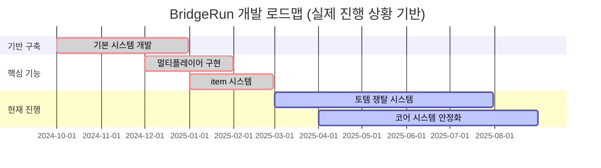

# 브릿지런 개발일지 (스프린트 15)

## 📅 개발 기간
2025년 6월 2일 ~ 2025년 6월 15일 (2주)

## 👨‍💻 작성자
김건우

**📋 비고**: 하모니아 프로젝트 기말 발표 기간과 겹쳐 개발 시간 제약, 문서화 작업 중심으로 진행

## 1. 주요 개발 목표

스프린트 15에서는 프로젝트 문서화 및 정리 작업에 집중했습니다:
- 기존 스프린트 문서들의 체계적 정리 및 개선
- 프로젝트 전체 문서 구조 재정비
- 포트폴리오 어필 포인트 강화를 위한 문서 최적화
- 게임 디자인 문서 및 개발 문서 업데이트

## 2. 스프린트 문서 체계화

### 2.1 기존 스프린트 문서 검토 및 개선

14개 스프린트 문서의 일관성과 완성도를 점검하고 개선했습니다.


*스프린트 1-14 문서 구조 및 내용 정리*

### 2.2 문서 표준화 작업
```
스프린트 문서 표준화 과정:
[기존 문서 분석] → [구조 통일] → [내용 보완] → [형식 개선] → [어필 포인트 강화]
        ↓              ↓            ↓            ↓               ↓
    14개 문서 검토    템플릿 설정   누락 내용 추가  이미지/코드 정리   기술 성장 스토리
```

### 2.3 개선된 문서 구조

```markdown
# 표준화된 스프린트 문서 구조
## 📅 개발 기간 & 작성자
## 1. 주요 개발 목표
## 2. 핵심 기능 구현 (이미지 + 다이어그램 포함)
## 3. 발생한 문제와 해결 과정
## 4. 기술적 성과 및 학습 포인트
## 5. 다음 스프린트 계획
## 6. 회고 및 느낀점
```


*일관된 구조와 풍부한 시각 자료가 포함된 개선된 문서*

## 3. 프로젝트 README 고도화

### 3.1 전체 프로젝트 시각화

README.md를 포트폴리오 수준으로 대폭 개선했습니다.


*게임 소개부터 기술 스택까지 체계적으로 정리된 메인 문서*

### 3.2 개발 로드맵 시각화


### 3.3 기술 스택 및 성과 정리


*언리얼 엔진, C++, 네트워킹 등 사용 기술과 달성 성과 체계화*

```markdown
# 핵심 성과 요약
- 🎮 **12명 동시 멀티플레이어** 안정적 지원
- 🏗️ **실시간 건설/파괴 시스템** 네트워크 동기화 완성  
- 🏆 **팀 기반 토템 쟁탈** 게임플레이 구현
- 📊 **14개 스프린트** 체계적 개발 과정 문서화
```

## 4. 게임 디자인 문서 최신화

### 4.1 전체 게임 디자인 문서 재구성

game-design-document.md를 현재 개발 상황에 맞게 대폭 업데이트했습니다.


*실제 구현된 기능들을 반영한 정확한 게임 디자인 문서*

### 4.2 직업 시스템 문서 완성

```markdown
# 5개 직업 시스템 상세 설계
## 시민 (Citizen) - 다목적 기본 직업
## 건설가 (Builder) - 건설 특화 직업  
## 직물사 (Weaver) - 로프 및 연결 전문
## 저격수 (Sniper) - 원거리 전투 특화
## 러너 (Runner) - 기동성 및 운반 전문
```

### 4.3 맵 & 테마 디자인 정리


*안데스 산맥 테마와 토템 쟁탈 메커니즘이 조화된 맵 설계*

## 5. 개발 문서 체계화

### 5.1 기술 구현 문서 정리

Technical Implementation 문서를 실제 구현 내용 기반으로 재작성했습니다.

```
기술 문서 구조:
docs/Development/
├── technical-implementation.md    // 핵심 기술 구현 상세
├── architecture-decisions.md     // 설계 결정 과정과 근거  
├── code-evolution/              // 코드 진화 과정
│   ├── networking-evolution.md   // 네트워킹 시스템 발전사
│   ├── ui-system-evolution.md    // UI 시스템 진화 과정
│   └── component-design-evolution.md // 컴포넌트 설계 발전
└── performance-optimization.md   // 성능 최적화 기록
```

### 5.2 코드 진화 과정 문서화


*Phase별 기술 발전 과정을 상세히 기록한 진화 문서들*

```cpp
// 네트워킹 시스템 진화 예시
Phase 1: 로컬 게임 (2024.10-11)
Phase 2: 기본 RPC (2024.12-2025.01) 
Phase 3: 서버 권한 (2025.02-04)
Phase 4: 데디케이티드 서버 (2025.05-06)

각 단계별 도전과제, 해결방법, 학습포인트 상세 기록
```

## 6. 포트폴리오 최적화 작업

### 6.1 어필 포인트 강화

각 문서의 기술적 어필 포인트를 명확히 했습니다.


*기술적 성장, 문제 해결 능력, 실무 적용성을 강조한 문서 구성*

### 6.2 스토리텔링 개선
```
개발자 성장 스토리:
"로컬 게임만 만들 줄 알았던 개발자" 
           ↓
"12명 동시 멀티플레이어 게임을 구축하는 네트워크 엔지니어"

핵심 메시지: 지속적 학습, 문제 해결, 기술적 깊이
```

### 6.3 시각 자료 계획 수립

각 문서에 필요한 이미지와 다이어그램을 체계적으로 계획했습니다.

```markdown
# 이미지 자료 계획
- 🏗️ **시스템 아키텍처**: 네트워크 구조, 컴포넌트 설계
- 🎮 **게임플레이**: 실제 플레이 스크린샷, 기능 시연
- 📊 **개발 과정**: 문제 해결 과정, Before/After 비교
- 🔧 **코드 품질**: 리팩토링 결과, 성능 개선 차트
```

## 7. 하모니아 프로젝트 기간 중 제한적 작업

### 7.1 개발 시간 제약 상황

하모니아 프로젝트 기말 발표 준비로 인해 BridgeRun 개발에 할애할 수 있는 시간이 크게 제한되었습니다.


*하모니아 프로젝트와 BridgeRun 개발 시간 분배*

### 7.2 제약 조건 하에서의 전략적 선택

**선택한 작업 방향:**
```
우선순위 기반 작업 선택:
[높은 우선순위] → 문서화 작업 (언제든 가능, 누적 효과 큼)
[중간 우선순위] → 기존 시스템 검토 (짧은 시간에도 의미)
[낮은 우선순위] → 새로운 기능 개발 (집중 시간 필요)
```

**문서화 중심 작업의 이유:**
- 하모니아 프로젝트 중간중간 짧은 시간에도 진행 가능
- 누적되는 작업으로 장기적 가치 높음
- 향후 스프린트의 효율성 제고

### 7.3 제한된 시간 내 달성한 성과

**실질적 작업 시간: 약 30% 수준**
- 하모니아 집중 기간: 6월 2일~13일
- 문서 작업 가능 시간: 6월 14일~15일 + 중간 틈새 시간
- 총 실질 작업 시간: 전체 스프린트 기간의 약 30%

**한정된 시간 내 집중 성과:**
- 핵심 스프린트 문서 3개 (9, 13, 14) 대폭 개선
- README 메인 구조 재정비
- 게임 디자인 문서 현황 반영 업데이트

## 8. 발생한 도전과 해결 과정

### 8.1 하모니아 프로젝트와의 시간 관리

**도전 과제:**
두 개의 중요한 프로젝트를 동시에 진행해야 하는 상황에서 효율적인 시간 관리가 필요했습니다.


*하모니아와 BridgeRun 프로젝트 병행 전략*

**해결 과정:**
```
시간 관리 전략:
1. 작업 특성 분석: 집중도 vs 유연성 요구사항 파악
2. 시간대별 배분: 하모니아(주력), BridgeRun(틈새 시간)
3. 작업 유형 선택: 문서화 작업으로 BridgeRun 작업 집중
4. 품질 기준 조정: 완벽함보다 의미있는 진전에 집중
```

### 8.2 대량 문서의 일관성 유지

**도전 과제:**
14개 스프린트 문서의 형식과 품질이 제각각이었습니다.


*초기 문서들의 형식 불일치와 내용 깊이 차이*

**해결 과정:**
```markdown
1. 템플릿 설계: 표준 구조와 형식 정의
2. 우선순위 설정: 핵심 스프린트(9, 13, 14) 먼저 개선
3. 점진적 적용: 한 번에 모든 문서가 아닌 단계적 개선
4. 품질 검증: 각 문서의 기술적 정확성과 어필 포인트 확인
```

### 8.3 기술적 내용의 대중적 표현

**도전 과제:**
복잡한 기술 내용을 이해하기 쉽게 설명하는 것이 어려웠습니다.

**해결 방안:**
```cpp
// Before: 전문적이지만 이해하기 어려운 설명
"ReplicatedUsing 콜백을 통한 클라이언트 동기화 최적화"

// After: 구체적이고 이해하기 쉬운 설명  
"네트워크 데이터가 변경될 때 모든 플레이어 화면에
즉시 반영되도록 하는 동기화 시스템 구현"
```

### 8.4 제한된 개발 시간의 효과적 활용

**시간 제약 상황:**
- 하모니아 프로젝트 우선순위로 인한 BridgeRun 개발 시간 부족
- 문서화 작업의 중요성과 개발 진행의 균형점 찾기

**효율적 접근 방식:**
```
제약 조건 하 최적화 전략:
1. 핵심 가치 집중: 포트폴리오 어필도가 높은 문서 우선
2. 누적 효과 활용: 향후 개발 효율성 증대를 위한 기반 작업
3. 유연한 작업 방식: 짧은 시간에도 진행 가능한 작업 선택
4. 품질 vs 완성도: 완벽함보다 의미있는 진전에 집중
```

## 9. 다음 스프린트 계획 (스프린트 16)

### 9.1 서버 인프라 구축 본격 시작
- Steam SDK 통합 시스템 구현
- 데디케이티드 서버 환경 완전 전환  
- 네트워크 아키텍처 최적화
- 기존 시스템들의 서버 환경 호환성 확보

### 9.2 문서화 작업의 연속성 유지
- 스프린트 16 진행과 함께 실시간 문서 업데이트
- 서버 인프라 구축 과정의 상세한 기록
- 기술적 도전과 해결 과정 문서화

### 9.3 포트폴리오 완성도 제고
- 이미지 및 시각 자료 추가 작업 (스프린트 16 완료 후)
- 전체 문서 구조의 최종 점검
- 포트폴리오 스토리텔링 완성

## 10. 회고 및 학습 포인트

### 10.1 문서화의 중요성 재인식

이번 스프린트를 통해 **체계적인 문서화의 가치**를 깊이 깨달았습니다:

**기술적 가치:**
- 개발 과정의 명확한 기록과 추적
- 문제 해결 과정의 체계적 정리
- 기술적 성장 과정의 객관적 증명

**포트폴리오 가치:**
- 단순한 결과물을 넘어선 과정의 스토리텔링
- 기술적 깊이와 문제 해결 능력의 구체적 어필
- 지속적 학습과 성장 의지의 증명

### 10.2 개발자로서의 메타 스킬 개발

**문서화 == 소통 능력:**
복잡한 기술적 내용을 명확하고 이해하기 쉽게 설명하는 능력이 개발자의 핵심 역량임을 인식했습니다.

**체계적 사고:**
14개 스프린트의 방대한 내용을 논리적으로 구조화하고 일관성 있게 정리하는 과정에서 체계적 사고 능력이 향상되었습니다.

### 10.3 외부 프로젝트와 메인 프로젝트의 병행 관리

**하모니아 프로젝트 경험을 통한 학습:**
두 개의 중요한 프로젝트를 동시에 관리하면서 얻은 소중한 경험이었습니다.

**프로젝트 관리 역량 향상:**
- **우선순위 설정**: 상황에 따른 유연한 우선순위 조정
- **시간 분할**: 각 프로젝트 특성에 맞는 시간 배분 전략
- **작업 선택**: 제약 조건 하에서 최대 효과를 낼 수 있는 작업 선택
- **품질 관리**: 완벽함과 현실성의 균형점 찾기

**실무 준비 관점에서의 가치:**
실제 업무 환경에서도 여러 프로젝트나 업무를 동시에 진행해야 하는 경우가 많기 때문에, 이번 경험은 실무 적응력 향상에 도움이 될 것입니다.

### 10.4 제한된 시간의 효율적 활용 경험

하모니아 프로젝트로 인한 시간 제약 속에서도 **BridgeRun 프로젝트의 가치를 높이는 의미있는 성과**를 달성할 수 있었습니다:

**학습 포인트:**
- **선택과 집중**: 모든 것을 하려 하지 않고 핵심 가치에 집중
- **누적 효과**: 당장 눈에 보이지 않더라도 장기적 가치가 있는 작업 선택
- **유연한 사고**: 제약 조건을 제약이 아닌 창의적 기회로 전환
- **현실적 목표**: 이상과 현실의 균형점에서 달성 가능한 목표 설정

**향후 개발에의 적용:**
앞으로도 비슷한 상황(취업 준비, 다른 프로젝트 등)에서 핵심에 집중하여 최대 효과를 낼 수 있는 경험을 축적했습니다. 특히 **문서화의 중요성**과 **체계적 정리의 가치**를 깊이 체감한 스프린트였습니다.

스프린트 15는 하모니아 프로젝트라는 외부 요인으로 인해 개발 시간이 제한되었지만, **문서화 중심의 전략적 접근**을 통해 BridgeRun 프로젝트 전체의 가치를 크게 높일 수 있었던 의미있는 스프린트였습니다. 

체계적으로 정리된 문서들은 향후 스프린트 16의 서버 인프라 구축 작업에 견고한 기반이 될 것이며, 무엇보다 **개발 과정 전체를 하나의 완성된 스토리로 만들어주는 연결고리** 역할을 하게 되었습니다.