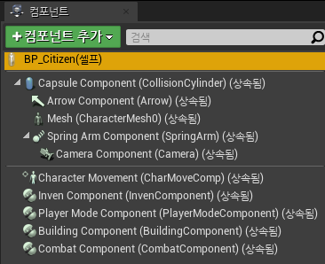
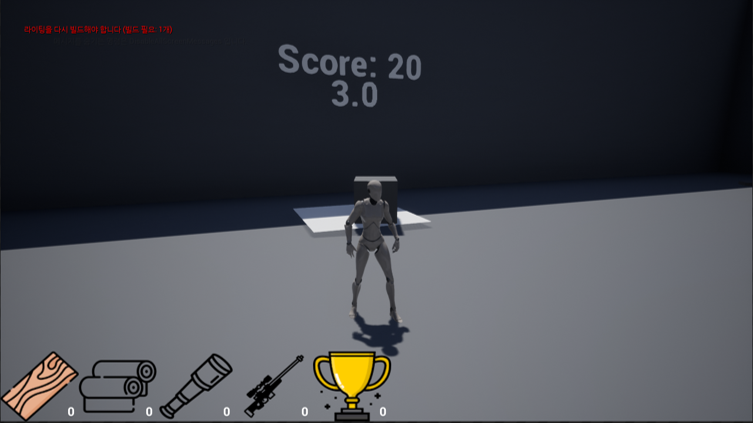
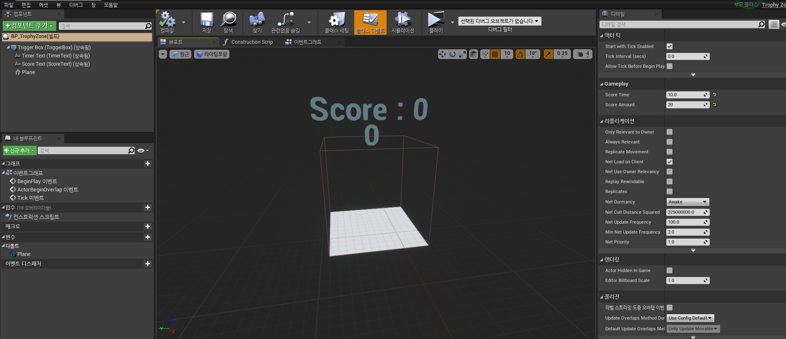
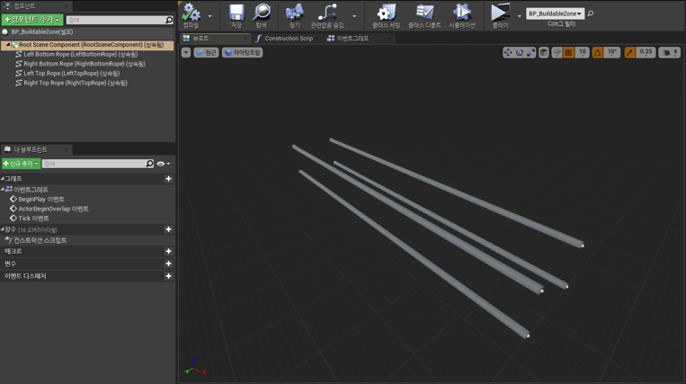
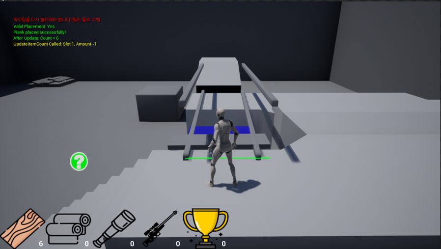
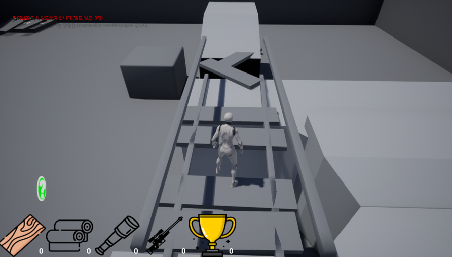
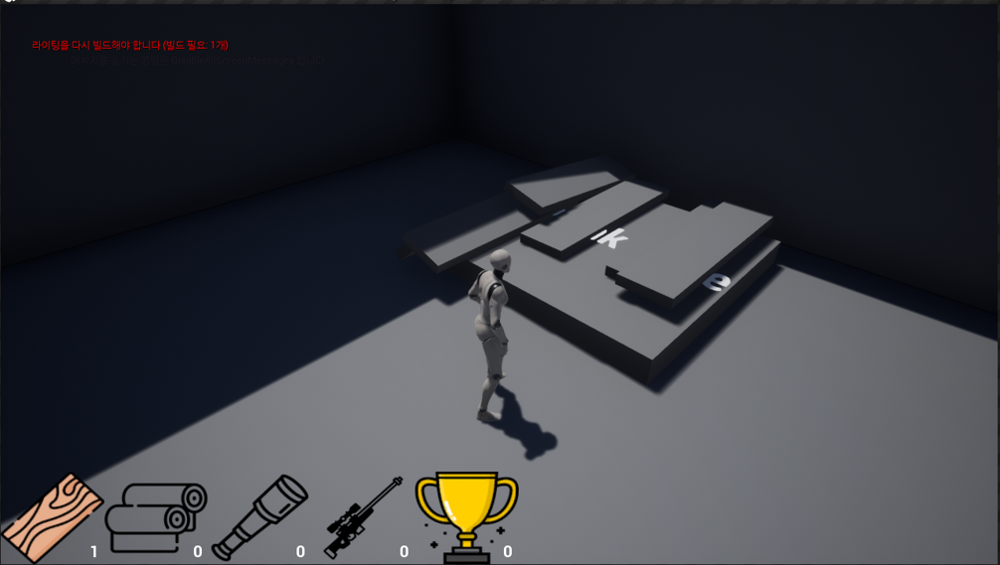

# 브릿지런 개발일지 (스프린트 2)

## 📅 개발 기간
2024년 11월 18일 ~ 2024년 12월 1일

## 👨‍💻 작성자
김건우

## 1. 주요 개발 목표

브릿지런의 핵심 게임플레이 요소인 점수 시스템과 다리 건설 시스템을 구현하였습니다. 주요 목표는 다음과 같습니다:
- 트로피와 트로피존을 통한 점수 획득 시스템 구축
- 다릿줄 기반의 다리 건설 시스템 개발
- 판자 설치 및 검증 시스템 구현
- 아이템 자동 생성 시스템 개발

## 2. 기본 시스템 구현

### 2.1 컴포넌트 기반 시스템 구조

*시티즌 클래스의 컴포넌트 구조*

기본 캐릭터 시스템을 여러 컴포넌트로 분리하여 확장성을 확보했습니다:
- InvenComponent: 인벤토리 관리
- PlayerModeComponent: 캐릭터 상태 관리
- BuildingComponent: 건설 시스템
- CombatComponent: 전투 시스템 (기본 구조만 구현)

### 2.2 트로피/트로피존 시스템

#### 트로피 시스템

*트로피 점수 획득 시스템 작동 모습*

```cpp
void AItem_Trophy::PickUp(ACitizen* Player)
{
    if (!Player) return;
    bIsHeld = true;
    
    if (CollisionComponent)
    {
        CollisionComponent->SetCollisionEnabled(ECollisionEnabled::QueryOnly);
        CollisionComponent->SetCollisionResponseToChannel(ECC_GameTraceChannel1, ECR_Overlap);
    }

    if (MeshComponent)
    {
        MeshComponent->SetSimulatePhysics(false);
    }

    FAttachmentTransformRules AttachRules(EAttachmentRule::SnapToTarget, true);
    AttachToActor(Player, AttachRules);
    SetActorRelativeLocation(FVector(100.0f, 0.0f, 50.0f));
}
```

#### 트로피존 시스템 

*트로피존의 블루프린트 구조*

실시간 점수 계산과 타이머 시스템을 구현했습니다:
```cpp
void ATrophyZone::OnScoreTimerComplete()
{
    if (!IsValid(PlacedTrophy)) return;
    
    CurrentScore += ScoreAmount;
    FString ScoreString = FString::Printf(TEXT("Score: %d"), CurrentScore);
    ScoreText->SetText(FText::FromString(ScoreString));
    TimerText->SetText(FText::FromString(TEXT("")));
    
    PlacedTrophy->Destroy();
    PlacedTrophy = nullptr;
    GetWorld()->GetTimerManager().ClearTimer(UpdateTimerHandle);
}
```

## 3. 다리 건설 시스템

### 3.1 스플라인 기반 BuildableZone 설계

*스플라인 컴포넌트를 활용한 다리 구조 시스템*

스플라인 컴포넌트를 선택한 핵심 이유:
- 맵 디자인의 확장성 확보
- 난이도 조절을 위한 다리 간격 동적 조정
- 다양한 전략적 요소 구현 가능

4가지 기본 다리 배치 패턴 구현:
- 좌상단-우하단: 경사형 다리 구조
- 좌상단-우상단: 수평 고공 다리
- 좌하단-우하단: 수평 저공 다리
- 좌하단-우상단: 역경사형 다리 구조

```cpp
ABuildableZone::ABuildableZone()
{
    RootSceneComponent = CreateDefaultSubobject<USceneComponent>(TEXT("RootSceneComponent"));
    RootComponent = RootSceneComponent;

    // 하단 로프 설정
    LeftBottomRope = CreateDefaultSubobject<USplineComponent>(TEXT("LeftBottomRope"));
    LeftBottomRope->SetupAttachment(RootComponent);
    LeftBottomRope->SetCollisionEnabled(ECollisionEnabled::QueryAndPhysics);

    RightBottomRope = CreateDefaultSubobject<USplineComponent>(TEXT("RightBottomRope"));
    RightBottomRope->SetupAttachment(RootComponent);
    RightBottomRope->SetRelativeLocation(FVector(0.0f, BridgeWidth, 0.0f));

    // 상단 로프 설정
    LeftTopRope = CreateDefaultSubobject<USplineComponent>(TEXT("LeftTopRope"));
    LeftTopRope->SetupAttachment(RootComponent);
    LeftTopRope->SetRelativeLocation(FVector(0.0f, 0.0f, 200.0f));
    
    RightTopRope = CreateDefaultSubobject<USplineComponent>(TEXT("RightTopRope"));
    RightTopRope->SetupAttachment(RootComponent);
    RightTopRope->SetRelativeLocation(FVector(0.0f, BridgeWidth, 200.0f));
}
```

### 3.2 건설 검증 및 프리뷰 시스템

*실시간 건설 가능 영역 시각화*


*판자 설치 완료 상태*

검증 시스템 주요 기능:
- 실시간 설치 가능 여부 확인
- 시각적 피드백 제공 (색상 변경)
- 로프 간격 기반 유효성 검사

```cpp
bool ABuildableZone::IsPlankPlacementValid(const FVector& StartPoint, const FVector& EndPoint)
{
    bool bStartValid = IsPointNearRope(StartPoint, LeftBottomRope);
    bool bEndValid = IsPointNearRope(EndPoint, RightBottomRope);

    if (!bStartValid || !bEndValid)
        return false;

    float Distance = FVector::Distance(StartPoint, EndPoint);
    float MaxAllowedLength = BridgeWidth * 1.5f;
    
    return Distance <= MaxAllowedLength;
}
```

## 4. 아이템 스폰 시스템

### 4.1 자동 생성 시스템

*판자 생성 구역*


*스폰존 블루프린트 구성*

아이템 스폰 시스템 특징:
- 주기적 아이템 생성
- 최대 개수 제한
- 파생 블루프린트를 통한 아이템 타입 확장

```cpp
void AItemSpawnZone::SpawnItem()
{
    if (CurrentItemCount >= MaxItemCount || ItemsToSpawn.Num() == 0)
    {
        GetWorld()->GetTimerManager().ClearTimer(SpawnTimer);
        return;
    }

    int32 RandomIndex = FMath::RandRange(0, ItemsToSpawn.Num() - 1);
    TSubclassOf<AItem> ItemToSpawn = ItemsToSpawn[RandomIndex];
    
    if (ItemToSpawn)
    {
        FVector SpawnLocation = GetRandomPointInVolume();
        FRotator SpawnRotation = FRotator(0.f);
        GetWorld()->SpawnActor<AItem>(ItemToSpawn,
            SpawnLocation,
            SpawnRotation);
    }
}
```

### 4.2 작동 과정

*실제 판자 생성 및 획득 과정*

## 5. 발생한 문제점과 해결

### 5.1 트로피존 상호작용 문제
- 문제: 트로피와 트로피존 간의 상호작용이 일방향으로만 작동
  - 트로피에서 트로피존은 인식되지만 반대는 동작하지 않음
  - 디버그 로그를 통해 캐스팅 문제 확인
  - 콜리전 설정의 불일치 발견

- 해결 과정:
  1. 프로젝트 설정에서 트로피존 전용 콜리전 채널 추가
  2. 콜리전 설정을 C++에서 BP로 이전하여 유연성 확보
  3. 컴포넌트 초기화 순서 최적화

```cpp
// 트로피존 콜리전 설정 최적화
if (CollisionComponent)
{
    CollisionComponent->SetCollisionEnabled(ECollisionEnabled::QueryOnly);
    CollisionComponent->SetCollisionObjectType(ECollisionChannel::ECC_PhysicsBody);
    CollisionComponent->SetGenerateOverlapEvents(true);
    CollisionComponent->SetCollisionResponseToChannel(ECC_GameTraceChannel1, ECR_Overlap);
}
```

### 5.2 스플라인 컴포넌트 확장성
- 문제: 다리 구조의 다양한 패턴 구현 시 유연성 부족
  - 초기 고정된 로프 위치로 인한 제약
  - 맵 디자인의 한계

- 해결 방안:
  1. 스플라인 컴포넌트의 동적 조정 기능 추가
  2. 4가지 기본 패턴 템플릿화
  3. 에디터에서 실시간 조정 가능하도록 개선

## 6. 다음 스프린트 계획

### 6.1 시스템 확장
- 전투 시스템 상세 구현
  - CombatComponent 기능 구현
  - 무기 시스템 개발
  - 데미지 처리 로직

- 건설 시스템 고도화
  - 다양한 건설 패턴 추가
  - 건설 제약 조건 다각화
  - 팀별 건설 영역 구분

### 6.2 게임플레이 요소
- 팀 시스템 개발
  - 팀별 리소스 관리
  - 팀 점수 시스템
  - 팀 간 상호작용

- UI/UX 개선
  - 인게임 HUD 개선
  - 팀 상태 표시
  - 건설 가이드 시스템

### 6.3 기술적 목표
- 네트워크 기능 준비
  - 기본 네트워크 구조 설계
  - 동기화 시스템 구현
  - 리플리케이션 규칙 설정

- 최적화
  - 스플라인 렌더링 최적화
  - 아이템 스폰 시스템 효율화
  - 메모리 사용량 개선
