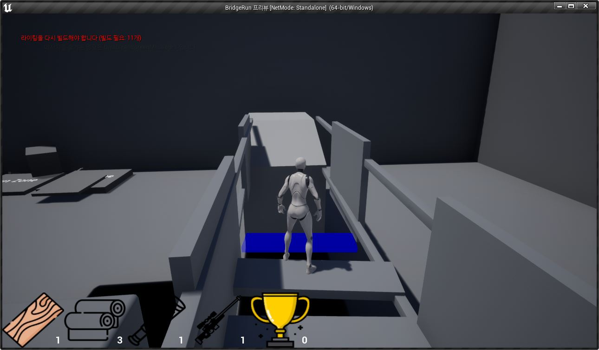
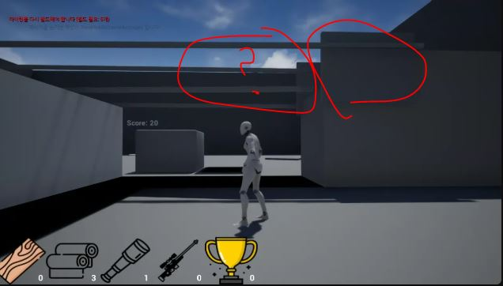
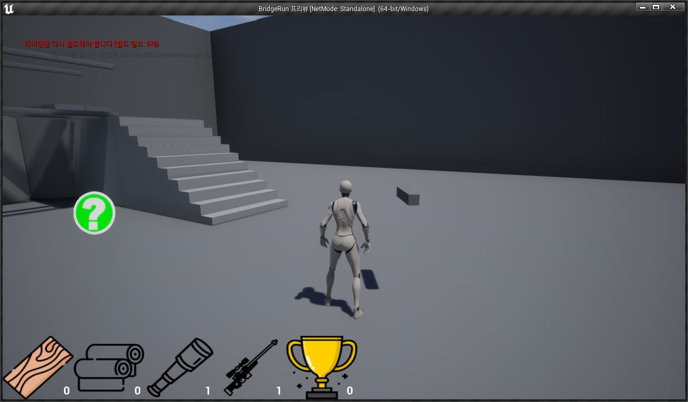
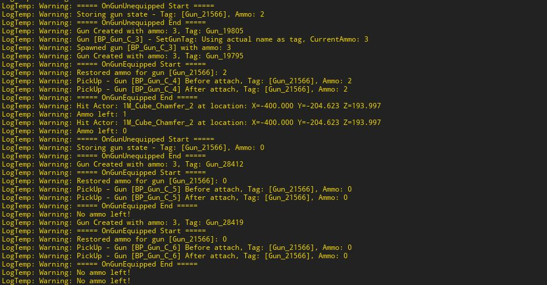
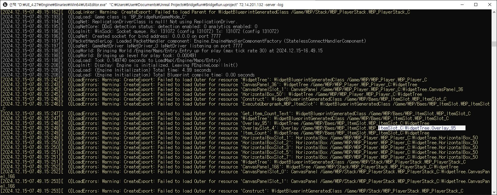
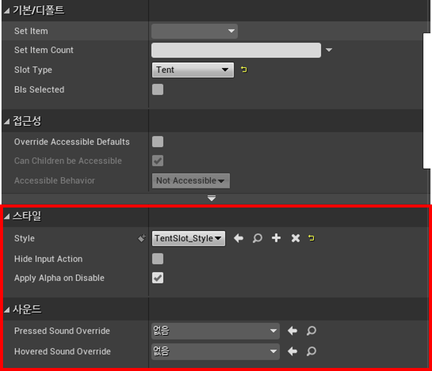
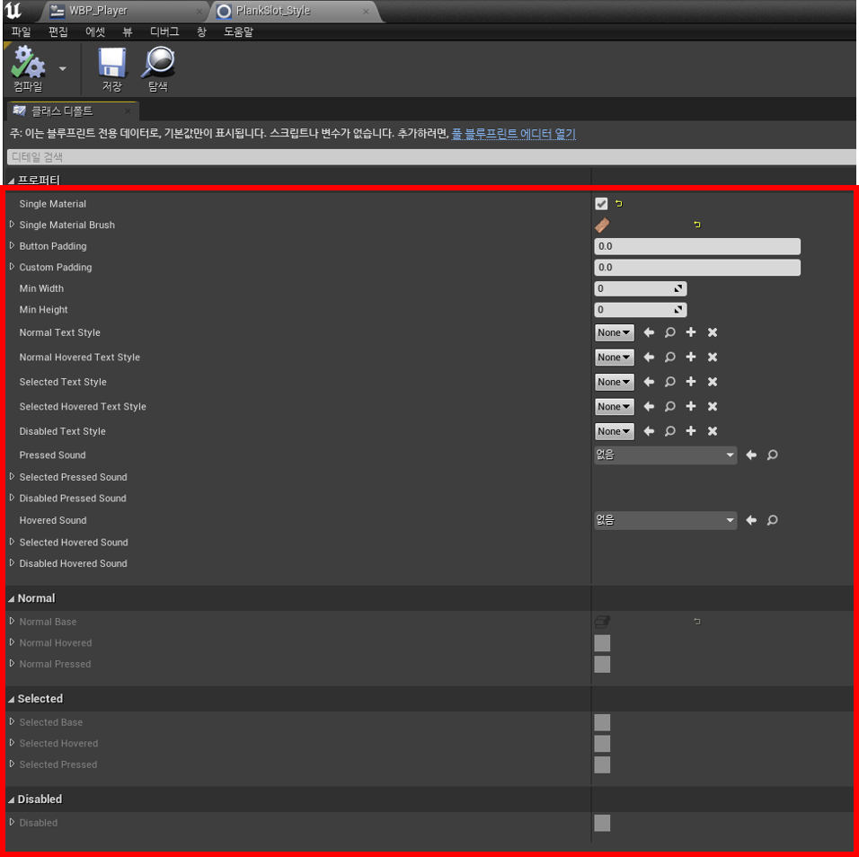

# 브릿지런 개발일지 (스프린트 3)

## 📅 개발 기간
2024년 12월 2일 ~ 2024년 12월 15일

## 👨‍💻 작성자
김건우

## 1. 주요 개발 목표

스프린트 3에서는 시스템 설계의 근본적인 개선과 전투 시스템 구현에 집중했습니다:
- Item 클래스 구조 전면 개편
- Tent 시스템 신규 개발
- 전투 시스템 구현 (총기, 망원경)
- UI 시스템 분석 및 개선 계획 수립

## 2. Item 시스템 개편

### 2.1 클래스 구조 재설계

기존의 단일 Item 클래스에서 상속받던 구조를 개별 아이템 클래스로 분리했습니다:

```cpp
// Item.h - 기본 클래스
UCLASS()
class BRIDGERUN_API AItem : public AActor
{
    GENERATED_BODY()
public:
    UPROPERTY(EditDefaultsOnly, Category = "Item")
    EInventorySlot ItemType;
    
    UPROPERTY(VisibleAnywhere, Category = "Components")
    UStaticMeshComponent* MeshComponent;
    
    UPROPERTY(VisibleAnywhere, Category = "Components")
    class UBoxComponent* CollisionComponent;
};

// Item_Plank.h - 분리된 Plank 클래스
UCLASS(Blueprintable)
class BRIDGERUN_API AItem_Plank : public AItem
{
    GENERATED_BODY()
public:
    AItem_Plank();
    
    UPROPERTY(EditAnywhere, Category = "Plank")
    bool bIsBuiltPlank;
    
    UPROPERTY(EditAnywhere, Category = "Preview")
    UMaterialInterface* ValidPlacementMaterial;
    
    UPROPERTY(EditAnywhere, Category = "Preview")
    UMaterialInterface* InvalidPlacementMaterial;
    
    void OnPlaced();
};
```

### 2.2 Plank 시스템 마이그레이션


*개선된 Plank 설치 시스템*

기존 Plank 시스템을 성공적으로 마이그레이션하며 다음과 같은 개선을 이루었습니다:
- 독립적인 클래스 구조로 인한 높은 유지보수성
- 프리뷰 시스템의 안정성 향상
- 설치 검증 로직 개선

## 3. Tent 시스템 구현

### 3.1 기본 구조


*텐트 설치 가능 영역 프리뷰*

```cpp
UCLASS(Blueprintable)
class BRIDGERUN_API AItem_Tent : public AItem
{
    GENERATED_BODY()
public:
    UPROPERTY(EditAnywhere, Category = "Tent")
    float DamageReduction;  // 미래 확장을 위한 데미지 감소율
    
    UPROPERTY(EditAnywhere, Category = "Tent")
    bool bBlocksVision;     // 시야 차단 기능
};
```

### 3.2 설치 시스템 문제점과 해결


*초기 텐트 설치 시스템의 문제점*

초기 발생한 문제점:
- 다릿줄 시작점에만 설치 가능한 제약
- 프리뷰와 실제 설치 위치 불일치
- 높이 조절 불가로 인한 유연성 부족

문제 원인 분석:
```cpp
// 초기 구현 - 문제가 있던 코드
bool ABuildableZone::IsTentPlacementValid(const FVector& Point)
{
    // 단순히 시작점과의 거리만 체크
    float DistanceToStart = FVector::Distance(
        Point, 
        LeftTopRope->GetLocationAtSplinePoint(0, ESplineCoordinateSpace::World)
    );
    return DistanceToStart <= MaxPlacementDistance;
}
```


*개선된 텐트 설치 시스템*

해결 방안:
```cpp
// 개선된 구현 - 자유로운 설치 지원
bool ABuildableZone::IsTentPlacementValid(const FVector& StartPoint, const FVector& EndPoint)
{
    // 왼쪽 설치 검증
    bool bLeftValid = false;
    {
        FVector TopPoint = LeftTopRope->GetLocationAtSplinePoint(0, ESplineCoordinateSpace::World);
        FVector BottomPoint = LeftBottomRope->GetLocationAtSplinePoint(0, ESplineCoordinateSpace::World);
        FVector TentPos = (StartPoint + EndPoint) * 0.5f;

        // 프로젝션을 통한 정확한 위치 계산
        FVector RopeDir = (TopPoint - BottomPoint).GetSafeNormal();
        FVector PointToBottom = TentPos - BottomPoint;
        float Projection = FVector::DotProduct(PointToBottom, RopeDir);

        // 설치 가능 범위 검증
        if (Projection >= 0 && Projection <= FVector::Distance(TopPoint, BottomPoint))
        {
            FVector ProjectedPoint = BottomPoint + RopeDir * Projection;
            float Distance = FVector::Distance(TentPos, ProjectedPoint);
            bLeftValid = Distance <= BridgeWidth * 0.25f;
        }
    }

    // 오른쪽도 동일한 방식으로 검증
    return bLeftValid || bRightValid;
}
```

## 4. 전투 시스템 구현

### 4.1 망원경 시스템


*망원경 기본 상태*


*초기 발생한 시점 전환 문제*


*수정된 망원경 확대 시점*

망원경의 주요 특징:
- 2~4배율 확대/축소
- 고정 지급 아이템
- 자연스러운 시점 전환

### 4.2 총기 시스템


*총기 기본 상태*


*총기 조준 시점*


*총기 교체 시스템*



*탄약 관리 시스템 로그*

총기 시스템의 주요 구현:
```cpp
void AItem_Gun::Fire()
{
    if (CurrentAmmo <= 0)
    {
        UE_LOG(LogTemp, Warning, TEXT("No ammo left!"));
        return;
    }

    if (ACitizen* Player = Cast<ACitizen>(GetOwner()))
    {
        FVector Start = GetActorLocation();
        FVector Forward = Player->GetActorForwardVector();
        FVector End = Start + (Forward * 5000.0f);

        FHitResult HitResult;
        FCollisionQueryParams QueryParams;
        QueryParams.AddIgnoredActor(this);
        QueryParams.AddIgnoredActor(Player);

        if (GetWorld()->LineTraceSingleByChannel(HitResult, Start, End, ECC_Visibility, QueryParams))
        {
            if (AActor* HitActor = HitResult.GetActor())
            {
                UE_LOG(LogTemp, Warning, TEXT("Hit Actor: %s"), *HitActor->GetName());
            }
        }
        CurrentAmmo--;
        
        DrawDebugLine(
            GetWorld(),
            Start,
            End,
            FColor::Red,
            false,
            2.0f
        );
    }
}
```


*전투 모드 시스템*

### 5.1 네트워크 테스트 시도
다음 스프린트를 위한 기초 작업으로 네트워크 기능을 테스트하던 중:
```bash
# 서버 테스트 명령어
"UE4Editor.exe" "프로젝트경로" IP주소 -server -log
```
예상치 못한 문제가 발생했습니다:



*변수 할당 문제로 인한 연결 오류*


*서버 연동 테스트 중 발견된 UI 변수 할당 문제*

문제를 추적하는 과정에서 Common UI의 구조적 한계를 발견하게 되었습니다.

### 5.2 Common UI 분석
Common UI의 문제점을 확인한 후, Slate UI 마이그레이션을 위해 현재 시스템을 분석했습니다:


*Slate UI로 가져올 Common UI의 핵심 기능 분석*



*Common UI의 현재 구조와 스타일링 시스템*



*현재 사용 중인 UI 속성들 분석*

현재 Common UI에서 실제 사용 중인 핵심 기능:
- 인벤토리 슬롯 관리
- 아이템 수량 표시
- 선택 상태 처리

반면, 불필요하게 포함된 기능들:
- 복잡한 애니메이션 시스템
- 과도한 스타일 속성
- 사용하지 않는 이벤트 핸들러

### 5.3 해결 방향 도출
이러한 분석을 바탕으로 다음 스프린트에서는 Slate UI로의 마이그레이션을 진행하기로 결정했습니다. 필요한 핵심 기능만을 구현하여 시스템의 효율성을 높이고, 유지보수성을 개선할 계획입니다.

## 6. 다음 스프린트 계획

### 6.1 Slate UI 마이그레이션
- 메모리 사용량 30% 감소 목표
- 불필요한 기능 제거를 통한 최적화
- 핵심 UI 기능만을 구현

### 6.2 네트워크 시스템 학습
네트워크 강의를 통해 멀티플레이어 게임을 위한 기초 지식을 습득할 예정입니다.

이번 스프린트에서 발견된 UI 시스템의 문제점들을 해결하고, 향후 멀티플레이어 기능 구현을 위한 준비를 진행하겠습니다.
