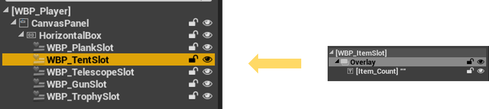

# 브릿지런 개발일지 (스프린트 3)

## 📅 개발 기간
2024년 12월 2일 ~ 2024년 12월 15일

## 👨‍💻 작성자
김건우

## 1. 주요 개발 목표

스프린트 3에서는 전투 시스템의 핵심 기능을 구현하고, 기존 시스템의 확장성을 개선했습니다. 주요 목표는 다음과 같습니다:
- Item 클래스 구조 개선 및 확장성 강화
- 무기 시스템 구현 (총기, 망원경)
- 천막(텐트) 시스템 추가
- 컴포넌트 기반 전투 시스템 구축

## 2. 시스템 구조 개선

### 2.1 Item 클래스 구조 개선


기존 Item 클래스에서 직접 상속받던 구조를 개별 아이템 클래스로 분리하여 확장성을 높였습니다:

```cpp
// Item_Plank.h
UCLASS(Blueprintable)
class BRIDGERUN_API AItem_Plank : public AItem
{
    GENERATED_BODY()
public:
    AItem_Plank();
    UPROPERTY(EditAnywhere, Category = "Plank")
    bool bIsBuiltPlank;
    UPROPERTY(EditAnywhere, Category = "Preview Materials")
    UMaterialInterface* ValidPlacementMaterial;
    UPROPERTY(EditAnywhere, Category = "Preview Materials")
    UMaterialInterface* InvalidPlacementMaterial;
    void OnPlaced();
};
```

### 2.2 텐트 시스템 구현


*텐트 설치 가능 영역 프리뷰 시스템*


*설치된 텐트의 모습*

텐트 시스템의 주요 기능:
- 다릿줄 근처 설치 가능
- 데미지 감소 효과
- 시야 차단 기능

```cpp
// Item_Tent.h 주요 구현
UCLASS(Blueprintable)
class BRIDGERUN_API AItem_Tent : public AItem
{
    GENERATED_BODY()
public:
    UPROPERTY(EditAnywhere, Category = "Tent")
    float DamageReduction;
    UPROPERTY(EditAnywhere, Category = "Tent")
    bool bBlocksVision;
    void OnBulletHit();
};
```

## 3. 전투 시스템 구현

### 3.1 무기 시스템

#### 망원경 시스템


*망원경 확대 시점*

망원경의 주요 특징:
- 2~4배율 확대/축소
- 고정 지급 아이템 (버리기 불가)
- 자연스러운 시점 전환

```cpp
void AItem_Telescope::ToggleZoom()
{
    if (ACitizen* Player = Cast<ACitizen>(GetOwner()))
    {
        if (UCameraComponent* Camera = Player->GetFollowCamera())
        {
            if (!bIsZoomed)
            {
                DefaultFOV = Camera->FieldOfView;
                if (USpringArmComponent* SpringArm = Player->FindComponentByClass<USpringArmComponent>())
                {
                    DefaultArmLength = SpringArm->TargetArmLength;
                    SpringArm->TargetArmLength = 0.0f;
                }
                Camera->SetFieldOfView(ZoomedFOV);
            }
            else
            {
                Camera->SetFieldOfView(DefaultFOV);
                if (USpringArmComponent* SpringArm = Player->FindComponentByClass<USpringArmComponent>())
                {
                    SpringArm->TargetArmLength = DefaultArmLength;
                }
            }
            bIsZoomed = !bIsZoomed;
        }
    }
}
```

#### 총기 시스템


*총기 장착 시 1인칭 시점*


*총기 획득 및 탄약 시스템*

총기 시스템의 주요 기능:
- 기본 3발의 탄약
- 조준 시 1인칭 전환
- 무기 버리기 및 줍기

```cpp
void AItem_Gun::Fire()
{
    if (CurrentAmmo <= 0)
    {
        UE_LOG(LogTemp, Warning, TEXT("No ammo left!"));
        return;
    }
    if (ACitizen* Player = Cast<ACitizen>(GetOwner()))
    {
        FVector Start = GetActorLocation();
        FVector Forward = Player->GetActorForwardVector();
        FVector End = Start + (Forward * 5000.0f);
        
        FHitResult HitResult;
        FCollisionQueryParams QueryParams;
        QueryParams.AddIgnoredActor(this);
        QueryParams.AddIgnoredActor(Player);
        
        if (GetWorld()->LineTraceSingleByChannel(HitResult, Start, End, ECC_Visibility, QueryParams))
        {
            if (AActor* HitActor = HitResult.GetActor())
            {
                UE_LOG(LogTemp, Warning, TEXT("Hit Actor: %s at location: %s"),
                    *HitActor->GetName(),
                    *HitResult.Location.ToString());
            }
        }
        CurrentAmmo--;
    }
}
```

### 3.2 전투 컴포넌트


*전투 모드 상태 관리 시스템*

CombatComponent를 통한 전투 상태 관리:
- 무기 상태 관리
- 조준 시스템
- 발사 처리

```cpp
void UCombatComponent::HandleShoot()
{
    UPlayerModeComponent* PlayerMode = OwnerCitizen ? OwnerCitizen->GetPlayerModeComponent() : nullptr;
    if (!OwnerCitizen || !PlayerMode || PlayerMode->GetCurrentMode() != EPlayerMode::Combat)
        return;
        
    if (EquippedGun)
    {
        EquippedGun->Fire();
    }
}

void UCombatComponent::HandleAim()
{
    UPlayerModeComponent* PlayerMode = OwnerCitizen ? OwnerCitizen->GetPlayerModeComponent() : nullptr;
    if (!OwnerCitizen || !PlayerMode || PlayerMode->GetCurrentMode() != EPlayerMode::Combat)
        return;
        
    if (EquippedTelescope)
    {
        EquippedTelescope->ToggleZoom();
    }
    else if (EquippedGun)
    {
        EquippedGun->ToggleAim();
    }
}
```

## 4. 발생한 문제점과 해결

### 4.1 무기 중복 선택 문제


*무기 중복 선택 시 발생하는 문제*

- 문제: 여러 무기를 동시에 장착하려 할 때 발생하는 충돌
- 원인: 무기 전환 로직에서 이전 무기 처리가 제대로 이루어지지 않음
- 해결: CombatComponent에서 무기 상태 관리 로직 개선

```cpp
void UCombatComponent::OnGunEquipped(AItem_Gun* Gun)
{
    if (!Gun || !OwnerCitizen || !GetWorld()) return;
    
    // 기존 무기 처리
    if (IsValid(EquippedGun) && EquippedGun != Gun)
    {
        if (EquippedGun->IsAiming())
        {
            EquippedGun->ToggleAim();
        }
        EquippedGun->SetActorHiddenInGame(true);
        EquippedGun->SetActorEnableCollision(false);
    }
    
    EquippedGun = Gun;
    EquippedGun->PickUp(OwnerCitizen);
}
```

### 4.2 망원경 시점 전환 문제


*망원경 모드 전환 시 발생하는 카메라 오류*

- 문제: 망원경 모드 전환 시 카메라 설정이 제대로 복구되지 않는 현상
- 해결 과정:
  1. 카메라 컴포넌트의 초기 설정 저장
  2. 모드 전환 시 SpringArm 길이 조정
  3. FOV 값 정밀 조정
