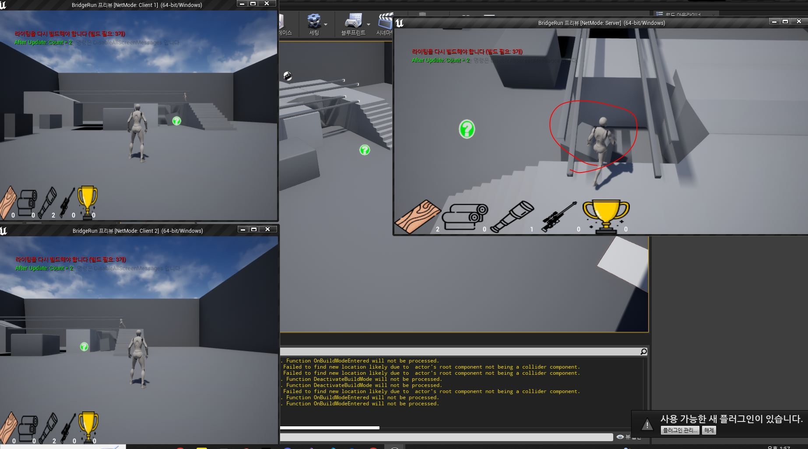
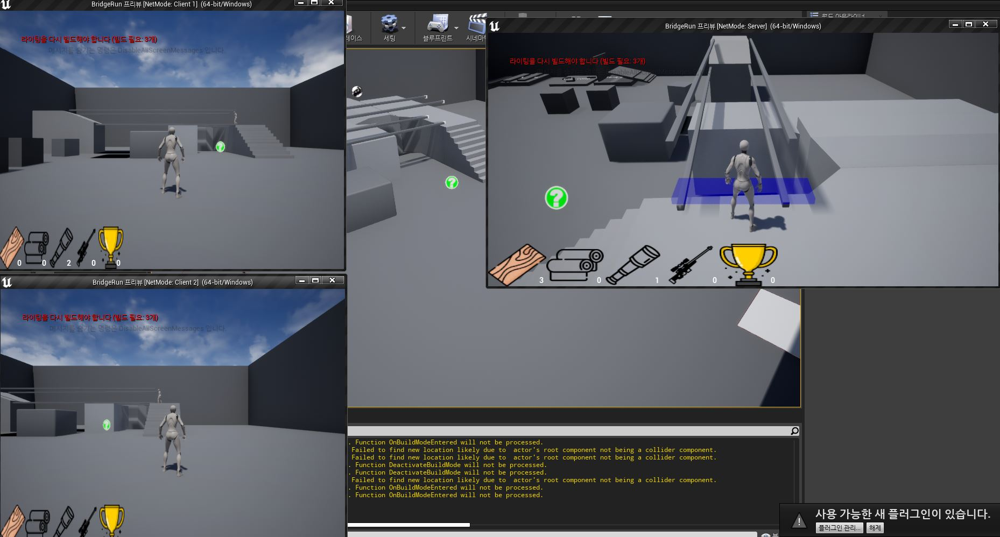
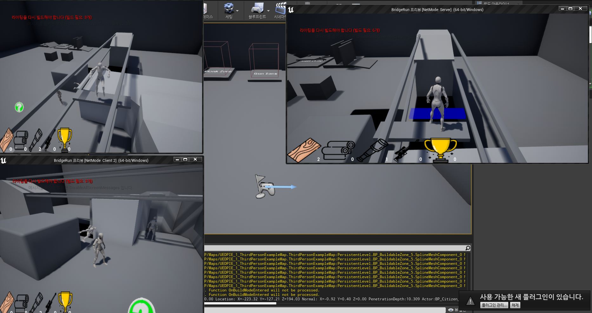
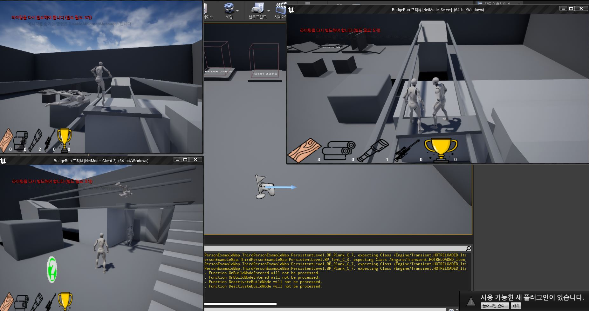

# 브릿지런 개발일지 (스프린트 4)

## 📅 개발 기간
2024년 12월 30일 ~ 2025년 1월 12일

## 👨‍💻 작성자
김건우

## 1. 주요 개발 목표

스프린트 4에서는 멀티플레이어 게임을 위한 네트워크 시스템 구현과 코드 구조 개선에 집중했습니다:
- 실시간 네트워크 동기화 시스템 구축
- 폴더 구조 재설계 및 정리
- 컴포넌트 간 의존성 개선

## 2. 실시간 네트워크 동기화 시스템

### 2.1 GameState 구현



*블루프린트 상속 구조에서 발생한 네트워크 동기화 문제*

멀티플레이어 환경으로 전환하면서 처음으로 RPC 시스템을 사용해보았습니다. 특히 _Implementation 패턴을 처음 접하면서 많이 배웠습니다:

```cpp
// BridgeRunGameState.h
UCLASS()
class BRIDGERUN_API ABridgeRunGameState : public AGameStateBase
{
    GENERATED_BODY()
public:
    ABridgeRunGameState();

    UPROPERTY(Replicated, BlueprintReadOnly)
    TArray<FBasicTeamInfo> Teams;

    UPROPERTY(Replicated, BlueprintReadOnly)
    float MatchTime;

    // RPC를 처음 써보면서 _Implementation 패턴을 배웠습니다
    UFUNCTION(NetMulticast, Reliable)
    virtual void UpdateTeamScore(int32 TeamId, int32 NewScore);
};
```

### 2.2 프리뷰 시스템 동기화



*프리뷰 위치가 클라이언트마다 다르게 표시되는 문제*

서버-클라이언트 간 프리뷰 위치 동기화를 위해 다음과 같은 RPC 체계를 구현했습니다:

```cpp
void UBuildingComponent::UpdatePreviewLocation()
{
    if (!PreviewMeshComponent || !OwningPlayer)
        return;

    FHitResult HitResult;
    if (GetBuildLocation(HitResult))
    {
        // 클라이언트에서 서버로 위치 업데이트 요청
        ServerUpdatePreviewLocation(HitResult.Location);
    }
}

void UBuildingComponent::ServerUpdatePreviewLocation_Implementation(const FVector& NewLocation)
{
    // 서버에서 위치 검증 후 모든 클라이언트에 전파
    if (ValidateLocation(NewLocation))
    {
        MulticastSetPreviewLocation(NewLocation);
    }
}
```

### 2.3 물리 동기화 시스템



*클라이언트의 물리 동기화 문제*

물리 시뮬레이션의 네트워크 동기화를 위한 시스템을 구현했습니다:

```cpp
UCLASS()
class BRIDGERUN_API ABuildableActor : public AActor
{
    GENERATED_BODY()

public:
    UFUNCTION(Server, Reliable)
    void ServerUpdatePhysics();

    UFUNCTION(NetMulticast, Reliable)
    void MulticastSyncPhysics();

protected:
    virtual void OnRep_ReplicatedMovement() override;
};
```

## 3. 현재까지의 구현 결과

### 3.1 서버-클라이언트 동기화



*서버와 클라이언트 간의 동기화가 개선된 모습*

현재까지 다음과 같은 시스템들이 구현되었습니다:
- 물리 기반 오브젝트의 실시간 동기화
- 클라이언트 권한 검증 시스템
- 네트워크 최적화 기초 작업

### 3.2 RPC 시스템 안정화
- Reliable/Unreliable RPC의 적절한 활용
- 네트워크 부하 최소화
- 클라이언트 예측 시스템 기초 구현

## 4. 폴더 구조 개선

네트워크 시스템 구현과 함께 프로젝트의 구조도 개선했습니다:

### 4.1 새로운 폴더 구조
```plaintext
Source/BridgeRun/
├── vs/
├── Private/
│   ├── Characters/
│   │   ├── BridgeRunCharacter.cpp
│   │   └── Citizen.cpp
│   ├── Core/
│   │   ├── BridgeRun.cpp
│   │   ├── BridgeRunGameMode.cpp
│   │   └── BridgeRunGameState.cpp
│   ├── Item/
│   │   ├── Item.cpp
│   │   ├── Item_Gun.cpp
│   │   └── Item_Trophy.cpp
│   └── Modes/
        ├── BuildingComponent.cpp
        └── CombatComponent.cpp
└── Public/
    └── [헤더 파일들...]
```

### 4.2 컴포넌트 의존성 개선
각 컴포넌트의 책임을 명확히 분리했습니다:
- CombatComponent: 전투 관련 로직
- BuildingComponent: 건설 시스템
- InvenComponent: 인벤토리 관리

## 5. UI System 개발 시도와 중단

### 5.1 CommonUI 분석
CommonUI 플러그인에서 필요한 핵심 기능들을 분석했습니다:

1. 스타일 시스템
   - 상태별 스타일 (Normal/Hovered/Selected/Disabled)
   - 브러시 설정 및 관리
   - 스타일 템플릿 시스템

2. 사운드 시스템
   - 상태별 사운드 (Pressed/Hovered)
   - 사운드 에셋 관리

3. 슬롯 시스템
   - 아이템 표시
   - 수량 오버레이
   - 선택 상태 관리

### 5.2 개발 중단 사유
다음과 같은 이유로 UI 시스템 구현을 일시적으로 중단했습니다:
- CommonUI와의 의존성 문제
- Style 에셋 구현의 복잡성
- 확장성 있는 구조 설계의 어려움

## 6. 다음 스프린트 계획

### 6.1 UI Slate 시스템 재도전
- CommonUI 의존성 최소화 방안 검토
- 커스텀 UI 컴포넌트 설계
- 스타일 시스템 단순화

### 6.2 팀 시스템 구현
- GameModeBase를 활용한 팀 시스템
- 팀별 점수 관리
- 승리 조건 구현

### 6.3 네트워크 테스트 강화
- 실제 환경 테스트
- 성능 최적화
- 안정성 개선

## 7. 회고 및 느낀점

이번 스프린트에서는 처음으로 언리얼 엔진의 네트워크 시스템을 심도있게 다뤄보았습니다. 특히 RPC와 _Implementation 패턴은 새로운 경험이었고, 많은 것을 배울 수 있었습니다.

UI Slate 시스템은 일시적으로 중단되었지만, 다음 스프린트에서 더 나은 접근 방식으로 재도전할 예정입니다. 특히 GameModeBase를 활용한 팀 시스템 구현을 통해 게임의 핵심 시스템을 완성하는 것이 주요 목표입니다.
