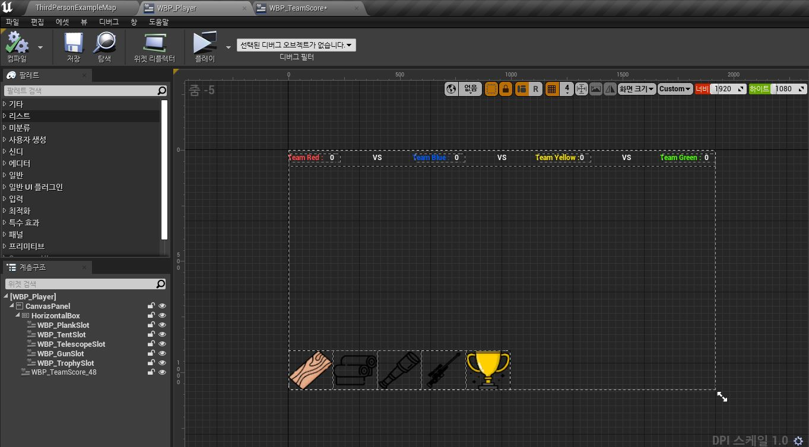

# 브릿지런 개발 회고록 (스프린트 7)

📅 회고 일자
2025년 3월 3일

👨‍💻 작성자
김건우

## 1. 개발 내용 요약

이번 스프린트에서는 Score 시스템 구현과 팀 UI 위젯 구성에 중점을 두었습니다. 주요 개발 내용은 다음과 같습니다:

### 1.1 점수 시스템 설계 및 구현

**목표**: 팀별 점수 관리 시스템 구축
**결과**: 성공적으로 구현 완료
**세부 내용**:
- 게임 인스턴스 기반 점수 관리 구조 설계
- 팀별 점수 저장 및 업데이트 로직 구현
- 트로피 획득 점수 연동

```cpp
// 핵심 코드
void UBridgeRunGameInstance::UpdateTeamScore(int32 TeamID, int32 NewScore)
{
    if (TeamID >= 0 && TeamID < TeamScores.Num())
    {
        TeamScores[TeamID] = NewScore;
        UE_LOG(LogTemp, Log, TEXT("Team %d Score Updated: %d"), TeamID, NewScore);
    }
}
```

### 1.2 트로피존 점수 시스템 연동

**목표**: 트로피존에서 발생하는 점수를 팀 점수 시스템에 연동
**결과**: 완벽하게 구현
**세부 내용**:
- 트로피존에 TeamID 속성 추가
- MulticastOnScoreUpdated 이벤트에서 게임 인스턴스 점수 업데이트
- 트로피 가치(TrophyValue)에 따른 점수 차등 부여
- 이벤트 기반 UI 업데이트 시스템 구현

```cpp
void ATrophyZone::MulticastOnScoreUpdated_Implementation(int32 NewScore)
{
    CurrentScore = NewScore;
    UpdateScoreText();
    
    if (UBridgeRunGameInstance* GameInst = Cast<UBridgeRunGameInstance>(GetGameInstance()))
    {
        GameInst->UpdateTeamScore(TeamID, NewScore);
    }
    
    // 블루프린트 이벤트 호출
    BP_ScoreUpdated(TeamID, NewScore);
}
```

### 1.3 팀 점수 UI 위젯 구현

**목표**: 실시간으로 업데이트되는 팀 점수 UI 구현
**결과**: 구현 완료 (이벤트 기반 업데이트 시스템으로 개선)
**세부 내용**:
- WBP_TeamScore 위젯 디자인 및 구현
- 팀 수에 따른 동적 UI 활성화/비활성화
- 주기적 Tick 대신 이벤트 기반 점수 업데이트 기능 구현



## 2. 성공 및 개선 사항

### 🌟 성공한 부분

- **게임 인스턴스 기반 점수 관리**: 게임 인스턴스를 활용하여 중앙집중식 점수 관리 시스템을 구축했습니다. 이를 통해 일관된 점수 데이터를 모든 게임 컴포넌트에서 접근할 수 있게 되었습니다.

- **트로피존-점수 연동**: 트로피존에서 트로피가 특정 시간 유지될 때 해당 팀에 점수가 정확히 부여되는 시스템을 구현했습니다. 트로피 크기에 따른 점수 차등 부여도 성공적으로 구현했습니다.

- **이벤트 기반 UI 업데이트**: Tick 이벤트 대신 BlueprintImplementableEvent를 활용한 이벤트 기반 UI 업데이트 시스템을 구현했습니다. 이를 통해 점수가 변경될 때만 UI를 업데이트하여 성능을 크게 개선했습니다.

- **팀 UI 가시성 제어**: 게임에서 활성화된 팀 수에 따라 UI 요소의 가시성을 자동으로 조절하는 기능을 구현했습니다. 이로 인해 2팀, 3팀, 4팀 모두 지원 가능한 유연한 UI가 완성되었습니다.

### 🔧 개선이 필요한 부분

- **UI 스케일링**: 다양한 해상도에서 팀 점수 UI의 크기와 위치가 일관되게 유지되도록 앵커 및 스케일 박스 설정이 필요합니다.

- **숫자 서식 지정**: 큰 점수 값에 대한 숫자 서식(천 단위 구분 등)이 아직 구현되지 않았습니다.

- **점수 변경 애니메이션**: 점수가 변경될 때 시각적 피드백이 부족합니다. 점수 증가/감소 시 애니메이션 효과 추가가 필요합니다.

## 3. 기술적 도전과 해결 방안

### 3.1 이벤트 기반 UI 업데이트 구현

**문제 상황**: 초기에는 Tick 이벤트를 사용하여 UI를 업데이트했으나, 이는 불필요한 성능 소모의 원인이 되었습니다.

**접근 방법**:
- 초기 접근: Tick 이벤트에서 주기적으로 모든 팀 점수 확인 → 비효율적
- 중간 접근: 타이머를 사용한 주기적 확인 → 부분적 개선
- 최종 접근: 이벤트 기반 업데이트 시스템 → 해결

**최종 해결책**:
1. TrophyZone 클래스에 BlueprintImplementableEvent 추가:
```cpp
UFUNCTION(BlueprintImplementableEvent, Category = "Gameplay")
void BP_ScoreUpdated(int32 TeamID, int32 NewScore);
```

2. 점수 업데이트 시 이벤트 발생:
```cpp
// MulticastOnScoreUpdated_Implementation 함수 내
BP_ScoreUpdated(TeamID, NewScore);
```

3. 블루프린트에서 이벤트 처리:
```
BP_ScoreUpdated → Get All Widgets Of Class → ForEach → Update Team Score
```

**학습 포인트**:
- 이벤트 기반 프로그래밍의 효율성
- 블루프린트와 C++ 통합 개발 기법
- 성능 최적화 접근 방법

### 3.2 위젯 참조 관리 문제

**문제 상황**: 트로피존에서 UI 위젯을 찾아 점수를 업데이트하는 과정에서 종종 "None에 접근" 오류가 발생했습니다.

**접근 방법**:
- 직접 위젯 레퍼런스 저장 시도 → 네트워크 복제 문제 발생
- 매번 위젯 검색 시도 → 성능 문제 가능성
- Get All Widgets Of Class 활용 → 해결

**현재 상태**: 
완전히 해결됨 - Get All Widgets Of Class를 사용하여 런타임에 존재하는 모든 팀 스코어 위젯을 찾아 업데이트하는 방식으로 구현

## 4. 시간 관리 및 일정 평가

### 계획 대비 실제 진행

| 작업 | 계획 시간 | 실제 소요 시간 | 차이 |
|------|-----------|----------------|------|
| 게임 인스턴스 점수 시스템 | 2일 | 3일 | +1일 |
| 트로피존 연동 | 1일 | 1일 | 0일 |
| 팀 점수 UI 위젯 | 2일 | 3일 | +1일 |
| 이벤트 기반 UI 업데이트 | - | 2일 | +2일 |

### 시간 관리 문제점

- 이벤트 디스패처 구현 문제로 계획에 없던 추가 작업 필요
- C++ 코드 컴파일 이슈로 인한 시간 지연
- 블루프린트-C++ 통합 과정에서 디버깅에 예상보다 많은 시간 소요

### 개선 방안

- 복잡한 기능 구현 전 프로토타입 먼저 작성
- C++ 구현 시 더 철저한 에러 체크와 디버깅 코드 추가
- 이벤트 시스템 설계 시 대체 방안도 함께 고려

## 5. 배운 점 및 인사이트

### 기술적 인사이트

**이벤트 기반 UI 업데이트**:
- 주기적 폴링보다 이벤트 기반 방식이 성능면에서 유리함
- BlueprintImplementableEvent의 활용 방법
- 함수 호출 계층 구조 설계의 중요성

**게임 인스턴스의 활용**:
- 게임 전체에 걸친 데이터 관리의 중요성
- 블루프린트와 C++ 코드 간의 효과적인 상호작용 방식
- 네트워크 환경에서의 데이터 일관성 유지 기법

**디버깅 기법**:
- 복잡한 이벤트 흐름 추적 방법
- 블루프린트에서의 효과적인 디버깅 접근법
- 컴파일 에러와 런타임 에러의 분리 처리

### 개인적 성장

- UI 시스템 개발에 대한 이해도 향상
- 이벤트 기반 프로그래밍 패러다임 습득
- 성능 최적화 관점의 사고 방식 발전

## 6. 다음 스프린트 준비

### 핵심 목표

- 점수 변경 시각적 피드백 구현
- 게임 종료 시 승리 팀 표시 시스템
- UI 해상도 대응 개선

### 주요 작업 항목

- 점수 변경 애니메이션 구현
- 승리 화면 UI 디자인 및 구현
- Scale Box 및 앵커 설정 최적화
- 다양한 해상도 테스트

### 준비 사항

- UI 애니메이션 참고 자료 수집
- 승리 화면 모킹 작업
- 테스트 해상도 목록 정의

## 7. 종합 평가 및 소감

이번 스프린트에서는 점수 시스템 구현과 UI 최적화에 중점을 두었습니다. 특히, Tick 이벤트 기반의 비효율적인 UI 업데이트 방식에서 이벤트 기반 시스템으로 전환한 것이 가장 큰 성과였습니다. 이 변경으로 점수가 실제로 변경될 때만 UI가 업데이트되어, 성능과 반응성이 크게 향상되었습니다.

BlueprintImplementableEvent를 활용한 C++와 블루프린트 간의 통합 개발 접근법은 매우 유용했습니다. 이를 통해 C++의 성능과 블루프린트의 유연성을 모두 활용할 수 있었습니다. 특히 트로피존에서 점수가 변경될 때 발생하는 이벤트를 UI 업데이트에 직접 연결함으로써, 불필요한 폴링 없이도 즉각적인 피드백을 제공할 수 있게 되었습니다.

이 과정에서 몇 가지 도전적인 문제들을 극복해야 했습니다. 특히 C++ 컴파일 이슈와 이벤트 디스패처 관련 문제는 상당한 시간을 소모했지만, 이를 해결하는 과정에서 언리얼 엔진의 이벤트 시스템과 C++ 통합에 대한 깊은 이해를 얻을 수 있었습니다.

다음 스프린트에서는 현재 구현된 기능을 시각적으로 더 개선하고, 다양한 해상도에서 일관된 사용자 경험을 제공하는 데 집중할 계획입니다. 또한 게임 종료 시 승리 팀을 명확하게 표시하는 기능을 추가하여 게임의 완성도를
높일 것입니다.
