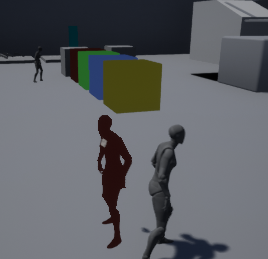
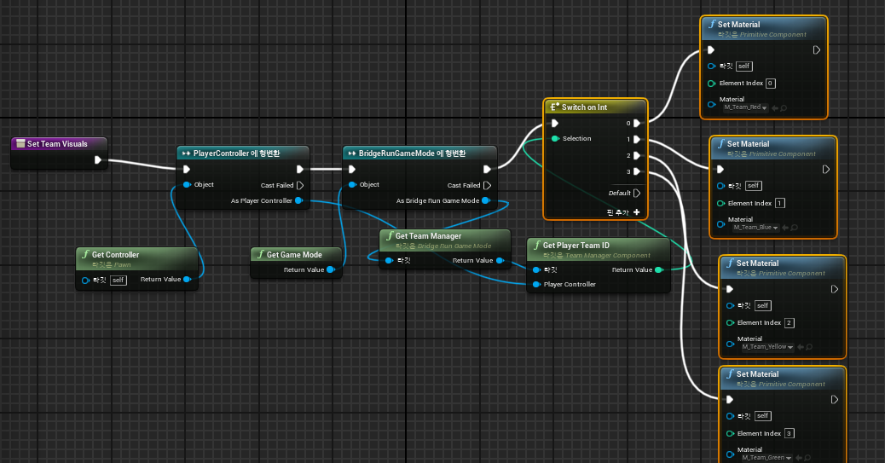
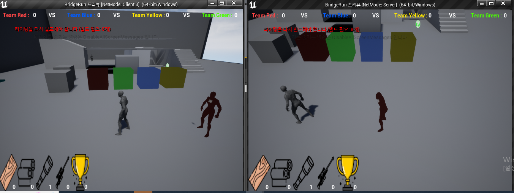
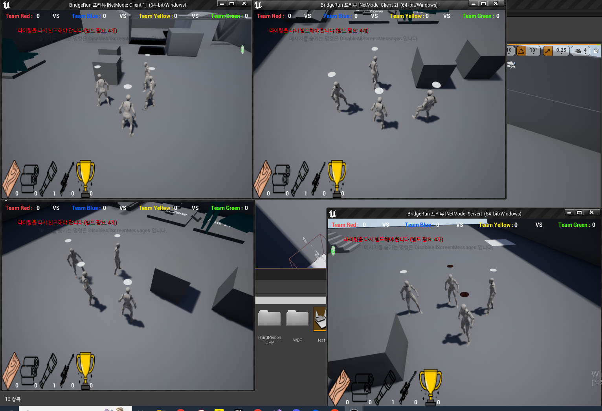

# 브릿지런 개발일지 (스프린트 8)

## 📅 개발 기간
2025년 3월 03일 ~ 2025년 3월 16일

## 👨‍💻 작성자
김건우

## 1. 주요 개발 목표
스프린트 8에서는 멀티플레이어 게임의 핵심 요소인 팀 시스템 구현에 집중했습니다:

* 팀 ID 할당 및 네트워크 복제 구현
* 팀별 시각적 구분을 위한 캐릭터 머티리얼 변경 시스템 구현
* 클라이언트-서버 간 팀 시각화 동기화 문제 해결

## 2. 팀 시스템 구현 및 문제점

### 2.1 네트워크 복제 및 팀 할당 구현
팀 시스템 구현을 위해 다음과 같은 클래스와 컴포넌트를 개발했습니다:

* TeamManagerComponent: 팀 할당 및 관리 담당
* BridgeRunPlayerState: 팀 ID 저장 및 네트워크 복제
* Citizen: 팀 색상 시각화 담당

처음 구현 시 다음과 같은 문제가 발생했습니다:

* 서버+클라이언트 창에서는 팀 색상이 제대로 표시되지만, 일반 클라이언트에서는 팀 색상이 표시되지 않음
* 팀 할당이 불균형하게 이루어져 일부 팀에 플레이어가 몰리는 현상 발생
* 팀 색상이 일부 플레이어에게만 적용되고 나머지는 회색으로 표시됨



### 2.2 문제 분석
팀 색상 시각화 문제의 원인을 분석한 결과:

#### TeamID 복제 문제:
* PlayerState의 TeamID가 모든 클라이언트에 제대로 복제되지 않는 경우가 있었음
* 로그 분석 결과 OnRep_TeamID 함수가 구현되지 않아 발생한 문제였음

#### 머티리얼 참조 문제:
* 팀 머티리얼(M_Team_Red, M_Team_Blue 등)이 클래스에 선언되었지만 실제로 초기화되지 않음
* 로그에서 "Team material for TeamID X is null" 에러 메시지 확인

#### 머티리얼 사용 플래그 문제:
* 스켈레탈 메시에 적용하려는 머티리얼에 필요한 사용 플래그가 없음
* 로그에서 "Material with missing usage flag was applied to skeletal mesh" 에러 메시지 확인

## 3. 문제 해결 방법

### 3.1 TeamID 복제 문제 해결
PlayerState에서 TeamID 속성의 복제 이벤트 처리 함수를 구현했습니다:

```cpp
// BridgeRunPlayerState.h
UPROPERTY(ReplicatedUsing = OnRep_TeamID)
int32 TeamID;

// OnRep_TeamID 함수 선언 추가
UFUNCTION()
void OnRep_TeamID();
```

```cpp
// BridgeRunPlayerState.cpp
void ABridgeRunPlayerState::OnRep_TeamID()
{
    // TeamID가 변경될 때 실행할 코드
    UE_LOG(LogTemp, Log, TEXT("PlayerState TeamID changed to %d"), TeamID);
    
    // 소유 캐릭터가 있는 경우 팀 머티리얼 업데이트
    AController* OwningController = Cast<AController>(GetOwner());
    if (OwningController)
    {
        APawn* ControlledPawn = OwningController->GetPawn();
        if (ControlledPawn)
        {
            ACitizen* Character = Cast<ACitizen>(ControlledPawn);
            if (Character)
            {
                Character->TeamID = TeamID;
                Character->SetTeamMaterial(TeamID);
            }
        }
    }
}
```

### 3.2 머티리얼 참조 문제 해결
BP_Citizen 블루프린트에서 팀 머티리얼 속성을 설정했습니다:

1. BP_Citizen 블루프린트를 열고 클래스 디폴트 값을 확인
2. "Team Materials" 카테고리에서 각 팀 머티리얼 설정:
   * M_Team_Red: 콘텐츠 브라우저에서 찾은 빨간색 팀 머티리얼
   * M_Team_Blue: 콘텐츠 브라우저에서 찾은 파란색 팀 머티리얼
   * M_Team_Yellow: 콘텐츠 브라우저에서 찾은 노란색 팀 머티리얼
   * M_Team_Green: 콘텐츠 브라우저에서 찾은 초록색 팀 머티리얼

이를 통해 "Team material for TeamID X is null" 에러를 해결했습니다.

### 3.3 머티리얼 사용 플래그 문제 해결
각 팀 머티리얼의 사용 플래그를 수정했습니다:

1. 콘텐츠 브라우저에서 팀 머티리얼(M_Team_Red, M_Team_Blue 등)을 찾아 더블클릭
2. 머티리얼 에디터의 디테일 패널에서 "Usage" 카테고리 찾기
3. "Used with Skeletal Mesh" 옵션 체크
4. 머티리얼 저장 및 컴파일

이를 통해 "Material with missing usage flag was applied to skeletal mesh" 에러를 해결했습니다.

### 3.4 팀 할당 균형 문제 해결
TeamManagerComponent의 AssignPlayerToTeam 함수를 수정하여 팀 배정을 균형 있게 만들었습니다:

```cpp
void UTeamManagerComponent::AssignPlayerToTeam(AController* PlayerController)
{
    if (!PlayerController)
        return;

    // 이미 팀에 할당되어 있는지 확인
    if (PlayerTeamMap.Contains(PlayerController))
        return;

    // 순차적으로 팀 할당 (균형을 위해)
    static int32 TeamCounter = 0;
    int32 TeamID = TeamCounter % ActiveTeamCount;
    TeamCounter++;
    
    UE_LOG(LogTemp, Warning, TEXT("Assigning player to team %d (Counter: %d)"), 
        TeamID, TeamCounter-1);
    
    // 팀 정보 업데이트
    TeamInfo[TeamID].PlayerCount++;
    PlayerTeamMap.Add(PlayerController, TeamID);
    
    // PlayerState 업데이트
    APlayerController* PC = Cast<APlayerController>(PlayerController);
    if (PC && PC->PlayerState)
    {
        ABridgeRunPlayerState* BridgeRunPS = Cast<ABridgeRunPlayerState>(PC->PlayerState);
        if (BridgeRunPS)
        {
            BridgeRunPS->SetTeamID(TeamID);
            UE_LOG(LogTemp, Warning, TEXT("Set PlayerState TeamID to %d"), TeamID);
        }
    }
    
    // 캐릭터에 팀 색상 직접 적용
    APawn* PlayerPawn = PlayerController->GetPawn();
    if (PlayerPawn)
    {
        ACitizen* Character = Cast<ACitizen>(PlayerPawn);
        if (Character)
        {
            Character->TeamID = TeamID;
            Character->MulticastSetTeamMaterial(TeamID);
            UE_LOG(LogTemp, Warning, TEXT("Applied team material %d to character"), TeamID);
        }
    }
}
```

## 4. 팀 색상 시각화 시스템 구현

### 4.1 Citizen 클래스 수정
캐릭터에 팀 색상을 적용하기 위해 Citizen 클래스에 팀 머티리얼 적용 함수를 구현했습니다:

```cpp
// Citizen.h에 추가
// TeamID 속성 추가 (복제 필요)
UPROPERTY(ReplicatedUsing = OnRep_TeamID)
int32 TeamID = -1;

// TeamID 변경 이벤트 처리 함수
UFUNCTION()
void OnRep_TeamID();

// 팀 머티리얼 적용 함수 (멀티캐스트로 모든 클라이언트에 전달)
UFUNCTION(NetMulticast, Reliable)
void MulticastSetTeamMaterial(int32 InTeamID);

// 팀 머티리얼 직접 적용 함수 (클라이언트에서도 호출 가능)
UFUNCTION(BlueprintCallable, Category = "Team")
void SetTeamMaterial(int32 InTeamID);
```

```cpp
// Citizen.cpp에 추가
void ACitizen::MulticastSetTeamMaterial_Implementation(int32 InTeamID)
{
    // 클라이언트와 서버 모두에서 실행됨
    SetTeamMaterial(InTeamID);
    UE_LOG(LogTemp, Warning, TEXT("MulticastSetTeamMaterial called with TeamID: %d"), InTeamID);
}

void ACitizen::SetTeamMaterial(int32 InTeamID)
{
    USkeletalMeshComponent* MeshComponent = GetMesh();
    if (!MeshComponent) return;
    
    // 머티리얼 인터페이스 포인터 확인
    UMaterialInterface* TeamMaterial = nullptr;
    
    // TeamID에 따라 적절한 머티리얼 선택
    switch(InTeamID)
    {
        case 0: TeamMaterial = M_Team_Red; break;
        case 1: TeamMaterial = M_Team_Blue; break;
        case 2: TeamMaterial = M_Team_Yellow; break;
        case 3: TeamMaterial = M_Team_Green; break;
        default: break;
    }
    
    if (!TeamMaterial)
    {
        UE_LOG(LogTemp, Error, TEXT("Team material for TeamID %d is null"), InTeamID);
        return;
    }
    
    // 중요: 엘리먼트 0번에만 적용 (여성 바디)
    MeshComponent->SetMaterial(0, TeamMaterial);
    // 엘리먼트 1번에도 적용 (남성 바디)
    MeshComponent->SetMaterial(1, TeamMaterial);
    
    UE_LOG(LogTemp, Log, TEXT("Applied team material for TeamID %d"), InTeamID);
}

void ACitizen::OnRep_TeamID()
{
    // TeamID가 변경될 때 머티리얼 적용
    SetTeamMaterial(TeamID);
    UE_LOG(LogTemp, Log, TEXT("OnRep_TeamID called with TeamID: %d"), TeamID);
}
```

### 4.2 네트워크 동기화 접근법 개선
여러 네트워크 동기화 접근법을 시도하며 최적의 해결책을 찾았습니다:

1. **블루프린트 의존 접근법**: 초기에는 블루프린트에서 팀 색상 로직을 구현했으나 네트워크 복제의 일관성 부족
2. **PlayerState 활용**: TeamID를 PlayerState에 저장하고 OnRep_TeamID 콜백 구현
3. **멀티캐스트 함수 도입**: 서버에서 모든 클라이언트로 팀 색상 변경 전파
4. **RPC 패턴 적용**: 서버 권한 검증을 추가한 명확한 통신 경로 구현
5. **복제 콜백 메커니즘**: 자동 상태 동기화를 위한 ReplicatedUsing 속성 활용

최종적으로 PlayerState에 TeamID를 저장하고, 멀티캐스트 함수와 복제 콜백을 조합하여 안정적인 네트워크 동기화를 구현했습니다.


*팀 시각화를 위한 블루프린트 구현*

### 4.3 PlayerState 연동
OnRep_PlayerState를 오버라이드하여 PlayerState에서 팀 ID를 가져와 적용하도록 수정했습니다:

```cpp
void ACitizen::OnRep_PlayerState()
{
    Super::OnRep_PlayerState();
    
    UE_LOG(LogTemp, Warning, TEXT("OnRep_PlayerState called"));
    
    // PlayerState에서 TeamID 가져와서 적용
    if (GetPlayerState())
    {
        ABridgeRunPlayerState* BridgeRunPS = Cast<ABridgeRunPlayerState>(GetPlayerState());
        if (BridgeRunPS)
        {
            int32 CurrentTeamID = BridgeRunPS->GetTeamID();
            UE_LOG(LogTemp, Warning, TEXT("OnRep_PlayerState: TeamID from PlayerState: %d"), CurrentTeamID);
            
            if (CurrentTeamID >= 0)
            {
                TeamID = CurrentTeamID;
                UE_LOG(LogTemp, Warning, TEXT("Setting team material to %d"), CurrentTeamID);
                SetTeamMaterial(CurrentTeamID);
            }
        }
    }
}
```

## 5. 팀 시스템 구현 결과

### 5.1 팀 관리 시스템
팀 관리 시스템이 성공적으로 구현되었습니다:

* 플레이어 팀 자동 할당 (균형 있는 배분)
* 팀 ID 네트워크 복제
* 팀별 색상 및 이름 관리


*클라이언트와 서버에서 서로 다른 팀 색상이 적용된 플레이어들*

### 5.2 팀 시각화 시스템
캐릭터 외형을 통해 팀을 구분할 수 있는 시각화 시스템을 구현했습니다:

* 캐릭터 머티리얼 기반 팀 색상 표시
* 네트워크 동기화를 통한 모든 클라이언트에서의 일관된 팀 시각화
* 팀 머티리얼의 스켈레탈 메시 호환성 확보


*4개의 클라이언트 창에서 팀 색상 동기화 문제 해결 후 모습*

## 6. 다음 스프린트 계획

### 6.1 커스텀 UI 위젯 개발
* 브릿지런 전용 UI 플러그인 개발
* 팀 기반 UI 템플릿 제작
* 게임 내 HUD 시스템 재설계

### 6.2 UI 기능 확장
* 인벤토리 UI 개선
* 팀 점수 디스플레이 구현
* 게임 정보 알림 시스템 개발

### 6.3 UI/UX 최적화
* 모바일 호환성 개선
* 다양한 해상도 대응
* 성능 최적화

## 7. 회고 및 느낀점
이번 스프린트에서는 멀티플레이어 게임의 핵심인 팀 시스템 구현에 집중했습니다. 특히 네트워크 복제와 머티리얼 적용에 관련된 다양한 문제들을 해결하면서 언리얼 엔진의 네트워크 시스템에 대한 이해도가 크게 향상되었습니다.

처음에는 간단해 보였던 팀 색상 적용 기능이 실제로는 네트워크 복제, 머티리얼 설정, 스켈레탈 메시 호환성 등 다양한 요소들이 복합적으로 얽힌 문제였습니다. 특히 "Material with missing usage flag" 에러를 해결하는 과정에서 언리얼 엔진의 머티리얼 시스템에 대한 이해를 높일 수 있었습니다.

본래 로비와 게임 방을 만들어 플레이어가 색상을 직접 선택하는 방식을 구상했지만, 에디터에서의 테스트를 위해 먼저 자동 팀 배정 시스템을 구현했습니다. 에디터에서 4명의 플레이어를 2vs2로 배정하는 과정에서 많은 어려움이 있었고, 향후에는 3명일 때 3팀으로, 또는 다양한 인원수에 따라 능동적으로 팀이 분배되는 시스템으로 확장할 계획입니다.

네트워크 동기화에서 특히 어려웠던 점은 서버와 클라이언트 간의 머티리얼 적용 타이밍 문제였습니다. 함수 호출 순서가 조금만 바뀌어도 결과가 크게 달라지는 것을 경험하며, 언리얼의 복제 시스템에 대한 더 깊은 이해가 필요하다고 느꼈습니다.

현재는 간단한 순환 방식의 팀 배정 로직을 사용하고 있지만, 플레이어 수에 따라 팀을 균등하게 분배하는 더 복잡한 알고리즘을 구현할 계획입니다. 이미 해당 로직의 기본 골격은 작성해 두었으며, 활성화를 위한 준비가 되어 있습니다.

다음 스프린트에서는 기획했던 커스텀 UI 위젯 개발을 진행할 예정입니다. 팀 시스템이 안정화되었으므로, 이를 기반으로 더 나은 사용자 경험을 제공할 수 있는 UI 시스템을 구축하겠습니다.

전체적으로 이번 스프린트는 게임의 멀티플레이어 기반을 강화하는 중요한 단계였으며, 이를 토대로 앞으로 더 안정적이고 확장 가능한 게임 시스템을 구축해 나갈 것입니다.