# 브릿지런 게임 프로젝트

## 1. 게임 간단 소개

브릿지런은 팀 기반 협력 전략 게임으로, 플레이어들이 협력하여 다리를 건설하고 토템(트로피)을 획득하여 점수를 얻는 3-4팀 대전 게임입니다. 각 팀은 다양한 직업의 플레이어로 구성되어 팀워크를 통해 승리를 목표로 합니다.

## 2. 배경 설정

2070년, 인류는 "대분열(The Great Divide)"이라는 전 지구적 위기를 겪었습니다. 기후 재앙, 자원 고갈, 기술 격차로 인해 사회는 무수히 많은 고립된 공동체로 파편화되었습니다. 이러한 혼돈 속에서 BORI(Bridges of Reconnected Integration, 보리)라는 글로벌 협력 기구가 설립되었습니다.

BORI는 "협력 없는 경쟁은 파괴를 낳고, 경쟁 없는 협력은 정체를 가져온다"는 철학을 바탕으로 '건설적 경쟁'이라는 새로운 패러다임을 제시했습니다. "브릿지런 대회"는 이 이념의 핵심 실현체로, 참가자들은 문화 토템을 수집하여 BORI의 "콜렉티브 인텔리전스" 시스템에 통합함으로써, 인류의 당면 문제 해결에 기여합니다.

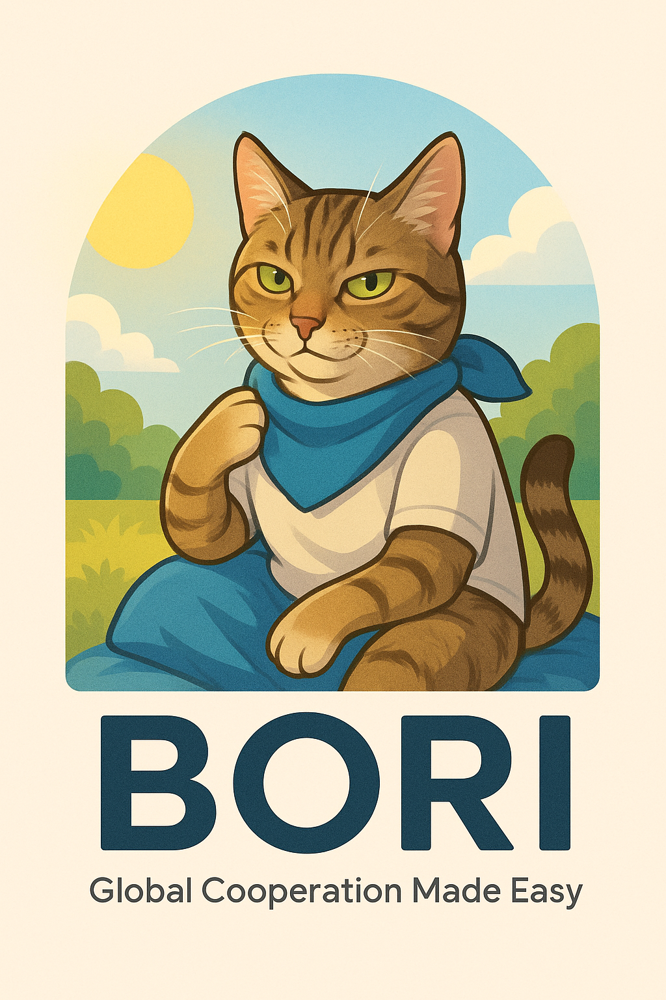

## 3. 게임 모드 및 라운드 구조

### 3.1 기본 구성

| 구성 요소 | 세부 내용 |
|---------|----------|
| 팀 구성 | 3-4팀 대전, 팀당 3명의 플레이어 |
| 라운드 구성 | 총 3라운드, 라운드당 4분 플레이 |
| 준비 시간 | 라운드 시작 전 30초 준비 시간 |
| 총 게임 시간 | 약 15분 (4분×3라운드 + 30초×3준비시간) |

### 3.2 점수 시스템

| 순위 | 획득 점수 |
|-----|----------|
| 1등 | 5점 |
| 2등 | 2점 |
| 3등 | -1점 |
| 4등 | -2점 |

**승리 조건**: 3라운드 종료 후 누적 점수가 가장 높은 팀 승리  
**동점 시**: 상위 등수를 더 많이 기록한 팀 승리

### 3.3 라운드별 특성

| 라운드 | 특징 | 목표 점수 |
|-------|------|----------|
| 1라운드 | • 기본 게임 규칙 적용 • 일반 토템만 등장 | 40점 |
| 2라운드 | • 골드 토템 등장 (20점) • 판자 생성 속도 감소 (40초당 1개) | 45점 |
| 3라운드 | • 다이아몬드 토템 등장 (30점) • 킹 토템 (차후 개발 예정) • 마지막 1분 골든타임 (모든 점수 2배) | 50점 |

## 4. 직업 시스템

| 직업명 | 특화 아이템 / 능력 | 특수 능력 | 이미지 예시 |
|--------|--------------------|-----------|-------------|
| 시민 | 없음 (기본 능력 보유) | 모든 아이템 기본 사용 가능 특화 능력 없음 | 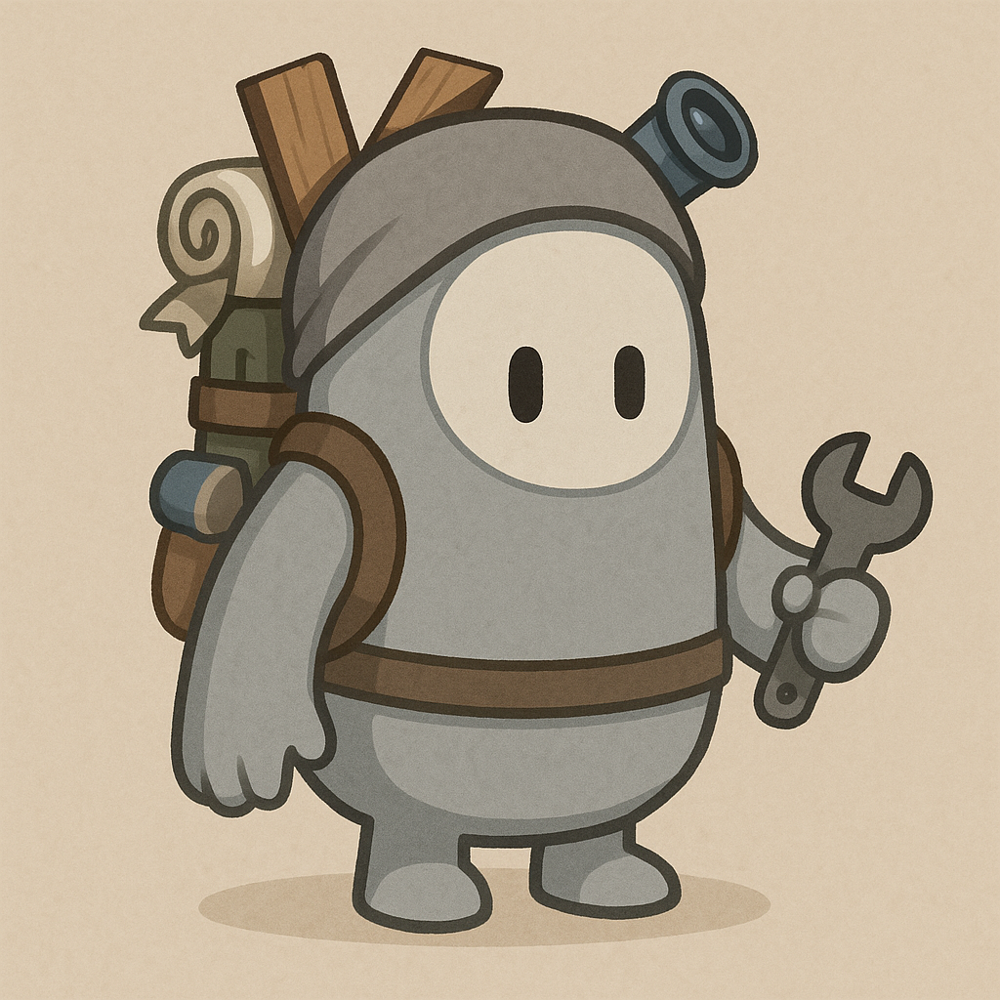 |
| 건설가 | 판자 | 판자 소지량 증가 판자 설치 속도 증가 낙사 시 판자 100% 보존 | 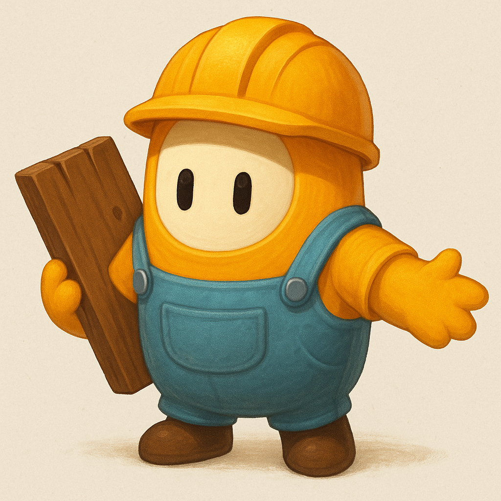 |
| 직물사 | 천막 | 천막 설치 속도 증가 천막 내구도 증가 낙사 시 천막 100% 보존 | 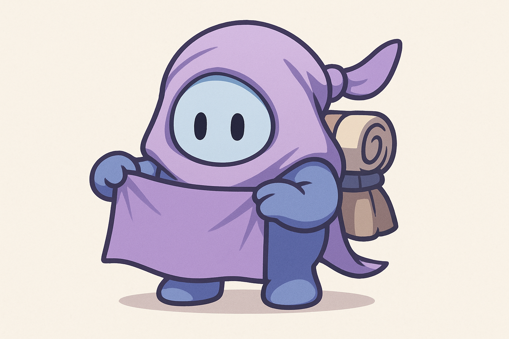 |
| 저격수 | 총 + 망원경 = 저격총 | 스코프 기능 활성화 원거리 정밀 사격 가능 낙사 시 총 100% 보존 | 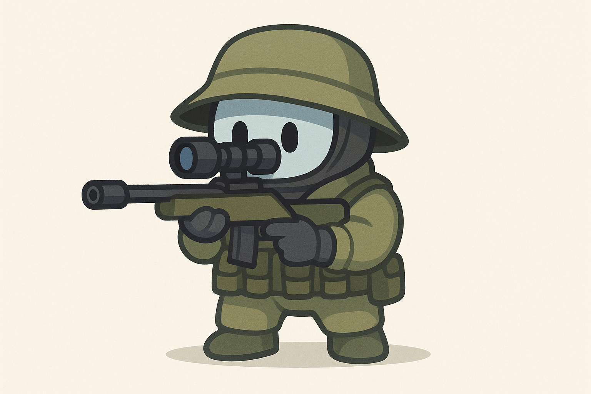 |
| 러너 | 없음 | 이동 속도 향상 토템 운반 시 속도 저하 최소화 이중 점프 가능 | 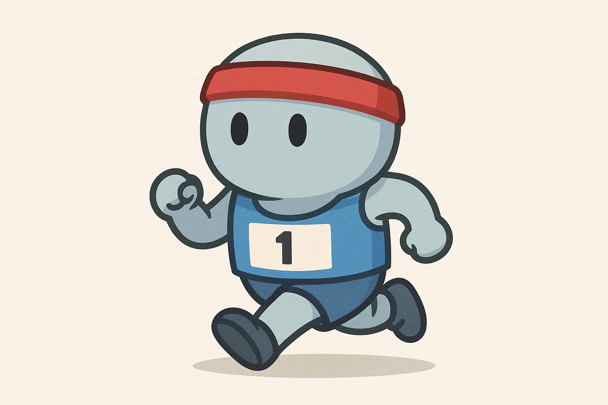 |

## 5. 맵 테마

### 5.1 안데스 테마: "잊혀진 지혜(Forgotten Wisdom)"

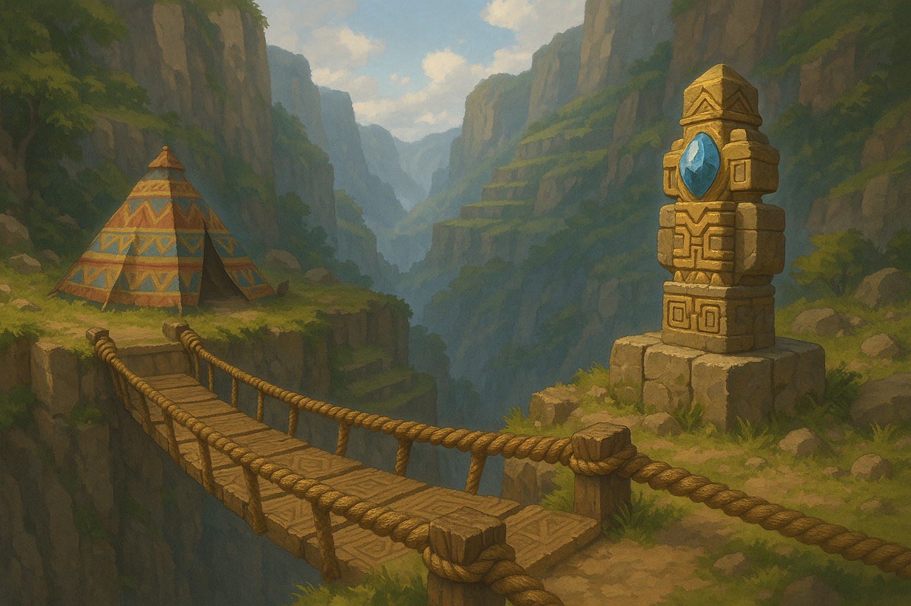

고대 잉카 문명의 흔적이 남아있는 안데스 협곡에서는, 최첨단 기술 없이도 복잡한 건축과 농업 시스템을 구축한 잉카의 지혜가 담긴 토템이 발견되었습니다. 참가자들은 잉카의 밧줄 다리 기술을 활용해 깊은 계곡을 건너며, 지속 가능성과 자연 활용의 비밀이 담긴 토템을 수집합니다.

| 요소 | 디자인 특징 |
|------|------------|
| **다릿줄** | 천연 섬유로 꼬인 두꺼운 밧줄, 자연스러운 황토색과 갈색 톤, 수작업으로 엮인 질감 |
| **판자** | 지역 목재로 만든 단단한 나무 판자, 짙은 나무 색상, 아즈텍 문양 새김, 자연스러운 나뭇결 패턴 |
| **텐트** | 알파카 양모와 지역 식물 소재의 직물 텐트, 기하학적 패턴의 다채로운 색상, 둥근 원뿔형 구조 |
| **토템** | 잉카 황금 문양으로 장식된 석조 토템, 상단에 청금석 수정, 태양과 달의 상징, 청동과 금색 조합 |

### 5.2 미래 도시 테마: "디지털 유산(Digital Legacy)"

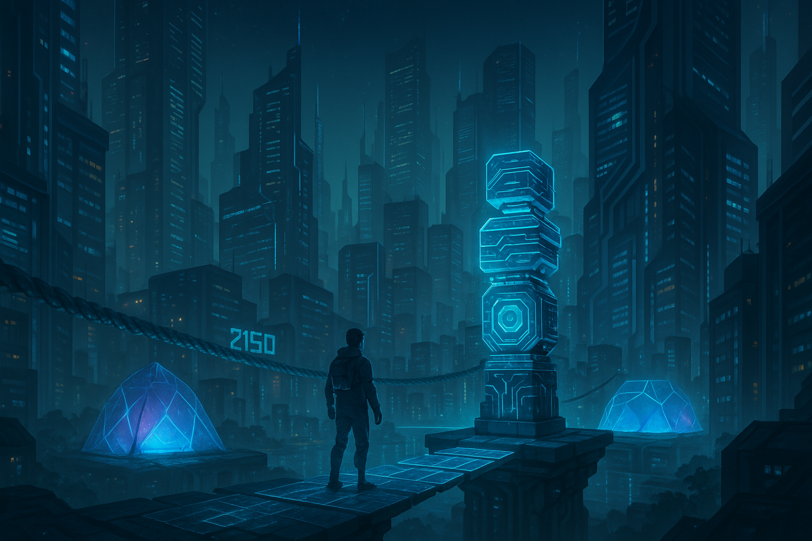

2150년 네오 도쿄의 초고층 빌딩 사이에 구축된 대회장에서는, 대분열 이전의 디지털 혁신 시대에 잃어버린 기술 데이터가 담긴 홀로그램 토템이 발견되었습니다. 참가자들은 첨단 에너지 다리를 구축해 단절된 도시 구역을 연결하며, 인류의 기술적 진보를 재통합합니다.

| 요소 | 디자인 특징 |
|------|------------|
| **다릿줄** | 나노 입자로 구성된 에너지 가이드라인, 파란색과 청록색 광선 효과, 중력에 영향받지 않는 부유 형태 |
| **판자** | 초경량 합금과 에너지 필드의 복합 플랫폼, 반투명한 청색 표면, 발을 딛으면 전자 패턴이 퍼짐 |
| **텐트** | 반투명 에너지 필드와 홀로그램 교란 기술, 육각형 패턴의 블루/퍼플 보호막, 주변 환경에 따라 색상 변화 |
| **토템** | 홀로그램 데이터 층이 겹쳐진 기술 장치, 맥동하는 에너지 코어, 움직이는 부품과 빛나는 회로 패턴 |

### 5.3 생태 환경 테마: "생명의 연결(Life's Connection)"

대분열 후 자연의 힘으로 복원된 아마존 생물권 보존 구역에서는, 멸종 위기에 처했던 종들의 생태적 지식이 담긴 생명 토템이 발견되었습니다. 참가자들은 자연 소재를 활용한 조화로운 다리를 만들어 서식지를 연결하며, 인류와 자연의 공존 방식을 재정립합니다.

| 요소 | 디자인 특징 |
|------|------------|
| **다릿줄** | 강화된 덩굴과 자연 섬유의 복합 로프, 푸르른 녹색 덩굴에 작은 잎과 꽃이 돋아남, 유기적 곡선 형태 |
| **판자** | 압축 대나무와 지속 가능한 식물 소재 판자, 녹색과 베이지 색조, 판자 위에 작은 식물이 자라남 |
| **텐트** | 대형 잎과 천연 위장 기술이 적용된 생체 텐트, 주변 환경과 조화되는 숲 색조, 실제 식물처럼 움직이는 형태 |
| **토템** | 다양한 식물 요소가 공생하는 유기체 토템, 생명력을 발산하는 씨앗, 꽃이 피고 잎이 움직이는 동적 형태 |

### 5.4 북유럽 테마: "공동체의 힘(Community Strength)"

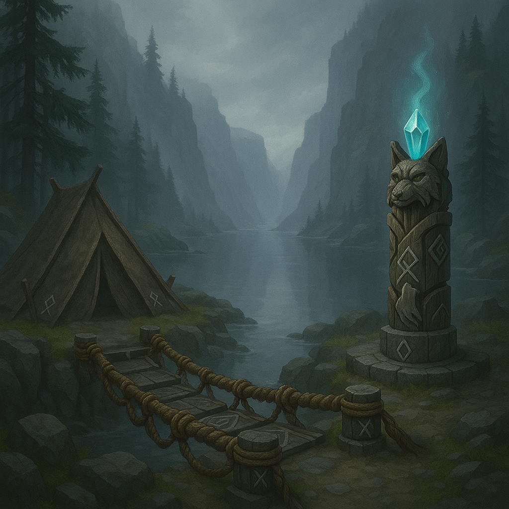

북극에 가까운 피오르드와 안개 낀 숲에서는, 극한 환경 속에서도 강한 공동체 문화를 발전시킨 바이킹의 지혜가 담긴 룬 토템이 발견되었습니다. 참가자들은 전통적인 목재와 돌을 활용한 다리를 건설하며, 공동체 결속과 극한 환경 적응의 지혜를 수집합니다.

| 요소 | 디자인 특징 |
|------|------------|
| **다릿줄** | 강한 동물 가죽을 엮어 만든 내구성 높은 로프, 어두운 갈색과 회색, 룬 문자가 새겨진 장식, 견고한 질감 |
| **판자** | 내한성 목재와 평평한 돌의 조합 판자, 회색 돌과 어두운 목재, 나선형 디자인과 룬 문양, 견고한 형태 |
| **텐트** | 두꺼운 동물 가죽과 방수 처리된 모피의 견고한 텐트, 갈색과 회색 색조, A프레임 구조, 보호 룬 문양 장식 |
| **토템** | 룬 문자가 새겨진 나무 토템, 오로라처럼 빛나는 신비한 크리스탈, 울프와 까마귀 문양, 고대 바이킹 공예품 느낌 |

### 5.5 장난감 테마: "창조적 상상(Creative Imagination)"

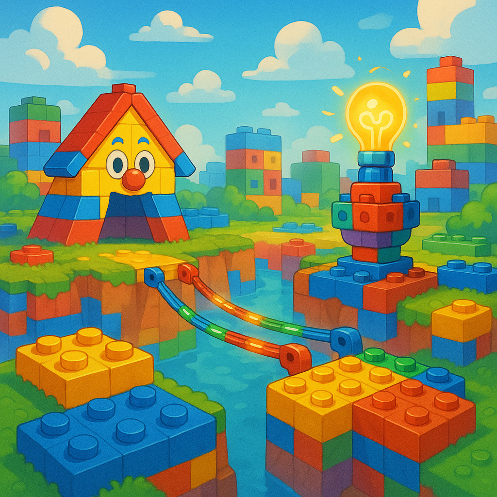

BORI의 특별 시뮬레이션 환경으로 설계된 이 가상 공간은 밝고 다채로운 조립식 블록으로 구성된 세계입니다. 이곳에서는 물리 법칙과 현실적 제약이 완화되어, 참가자들의 순수한 상상력을 자극합니다.

| 요소 | 디자인 특징 |
|------|------------|
| **다릿줄** | 밝은 색상의 플라스틱 조립 레일, 빨강, 파랑, 노랑, 초록의 원색 사용, 규칙적인 연결 구조, 빛나는 특수 효과 |
| **판자** | 다양한 색상의 조립식 블록 플랫폼, 노란색, 빨간색, 파란색 등 원색, 표면에 돌기 패턴, 밟으면 소리나 색 변화 |
| **텐트** | 다양한 색상의 종이 상자나 투명한 플라스틱 돔, 원색적이고 단순한 형태, 캐릭터 그림이나 패턴 장식 |
| **토템** | 빛나는 블록으로 구성된 전구 모양 토템, 회전하며 빛나는 아이디어 구체, 다양한 색상의 조립식 부품, 입체 퍼즐 |

## 6. 토템(트로피) 시스템

### 6.1 토템 유형

| 토템 유형 | 외관 | 가치 | 등장 | 효과 |
| ----- | ----- | ----- | ----- | ----- |
| **일반 토템** | 기본 석조 토템, 팀 색상으로 빛남 | 10점 | 모든 라운드 (45초마다 1~2개 생성) | 운반 시 이동 속도 30% 감소 |
| **골드 토템** | 금색으로 빛나는 고급 토템 | 20점 | 2라운드부터 (2분마다 중앙에 1개) | 운반 시 이동 속도 40% 감소 |
| **다이아몬드 토템** | 푸른 빛의 다이아몬드 크리스탈 토템 | 30점 | 3라운드부터 (라운드당 1개) | 운반 시 이동 속도 50% 감소 |
| **킹 토템** | (차후 개발 예정) | 특수 승리 조건 | 추후 개발 | 추후 개발 |

### 6.2 토템존

| 토템존 유형 | 위치 | 점수 배율 | 특징 |
| ----- | ----- | ----- | ----- |
| **팀 토템존** | 각 팀 본진 근처에 1개씩 | x1 (기본 배율) | • 상대적으로 안전 • 팀 색상의 원형 플랫폼 • 낮은 점수 획득 |
| **중립 토템존 (일반)** | 맵 중앙 부근 | x2 배율 | • 접근성 보통 • 중립 색상(흰색) 플랫폼 • 중간 점수 획득 |
| **중립 토템존 (고위험)** | 위험 지역 근처 | x5 배율 | • 접근 어려움 • 금색 플랫폼 • 높은 점수 획득 • 경쟁이 치열함 |

### 6.3 점수 획득 방식

| 점수 획득 요소 | 메커니즘 | 상세 설명 |
| ----- | ----- | ----- |
| **기본 점수** | 토템 가치 × 토템존 배율 | 10초마다 점수 획득 |
| **유지 보너스** | • 30초 유지: 1.5배 점수 • 60초 유지: 2배 점수 | 동일 토템존에 토템 유지 시간에 따른 추가 배율 |
| **경쟁 메커니즘** | 적 팀 접근 시 점수 획득 일시 중단 | 적 플레이어가 토템존 5m 이내 접근 시 발동 |
| **독점 보너스** | 매 10초마다 +10점 추가 | 한 팀이 모든 토템존 점유 시 적용 |
| **골든타임** | 모든 점수 2배 | 3라운드 마지막 1분 동안 적용 |

### 6.4 토템 낙사 처리

* 낙사 시 항상 드롭 (100%)  
* 5초 후 떨어진 지점 근처에 자동 리스폰  
* 아무 플레이어나 다시 획득 가능

## 7. 아이템 시스템

### 7.1 판자 (Bridge Plank)

| 항목 | 세부 내용 |
| ----- | ----- |
| **용도** | 다리 건설의 기본 자재 |
| **모델링** | 목재 재질의 직사각형 판자, 팀 색상으로 표시 |
| **초기 배치** | 팀 베이스에 10개 |
| **스폰 빈도** | • 1라운드: 20초마다 1개 • 2-3라운드: 40초마다 1개 |
| **스폰 위치** | 각 팀 본진의 판자 생성 필드 |
| **최대 누적량** | 팀 베이스당 15개 |
| **소지 제한** | • 일반 플레이어: 최대 5개 • 건설가: 최대 8개 |
| **낙사 처리** | 건설가는 유지, 타 직업은 50% 드롭 |
| **UI 표시** | 현재 소지 개수/최대 소지 개수, 다음 생성까지 남은 시간 |

### 7.2 천막 (Tent)

| 항목 | 세부 내용 |
| ----- | ----- |
| **용도** | 시야 차단 및 방어용 구조물 |
| **모델링** | 원뿔형 텐트, 팀 색상으로 표시 |
| **초기 배치** | 팀 베이스에 1개 |
| **스폰 빈도** | 120초마다 1개 |
| **스폰 위치** | 각 팀 본진의 천막 생성 필드 |
| **최대 누적량** | 팀 베이스당 2개 |
| **설치 제한** | 팀당 최대 2개까지 동시 설치 가능 |
| **내구도** | • 일반: 총알 5발에 파괴 • 직물사 설치: 총알 8발에 파괴 |
| **지속 시간** | 60초 후 자동 소멸 |
| **낙사 처리** | 직물사는 유지, 타 직업은 50% 드롭 |
| **UI 표시** | 설치된 천막 내구도, 남은 시간 |

### 7.3 총 (Gun)

| 항목 | 세부 내용 |
| ----- | ----- |
| **용도** | 적 플레이어 견제 및 구조물 파괴 |
| **모델링** | 미래형 에너지 총, 팀 색상으로 표시 |
| **초기 배치** | 맵 중앙에 게임 시작 30초 후 등장 |
| **스폰 빈도** | 120초마다 1개 |
| **스폰 위치** | 중립 지대의 총 생성 필드 |
| **수량** | 팀당 1개씩 존재 (총 3-4개) |
| **탄약** | 8발 제한 (재장전 불가) |
| **효과** | • 플레이어 타격: 3초간 둔화 효과 (이동 속도 50% 감소) • 천막 타격: 내구도 감소 |
| **낙사 처리** | 저격수는 유지, 타 직업은 드롭 후 10초 뒤 팀 베이스로 귀환 |
| **UI 표시** | 잔여 탄약 수, 조준점 |

### 7.4 망원경 (Telescope)

| 항목 | 세부 내용 |
| ----- | ----- |
| **용도** | 원거리 정찰 및 특수 토템 탐지 |
| **소지 상태** | 모든 플레이어 기본 소지 |
| **기능** | • 줌 레벨: 2x, 4x 조절 가능 • 사용 중 이동속도 30% 감소 • 토템 위치 하이라이트 표시 |
| **직업 시너지** | 저격수가 총과 함께 사용 시 스코프 기능 활성화 |
| **UI 표시** | 망원경 보기 활성화 시 외곽 테두리 효과 |

## 8. 맵 구조 및 리스폰 시스템

### 8.1 맵 구성

* **팀 본진**: 각 팀 고유 시작 지점, 안전한 구역  
* **중립 지대**: 중앙 부분, 고가치 토템과 아이템 스폰  
* **위험 지역**: 다리 건설이 필요한 구간, 낙사 위험  
* **토템존**: 팀 전용과 중립 토템존 분산 배치

### 8.2 다중 리스폰 시스템

* **팀 베이스 리스폰**: 항상 안전한 기본 리스폰 지점  
* **전방 리스폰 구역**: 맵 곳곳에 설치, 적이 근처에 없을 때만 활성화  
* **낙사 처리**:  
  * 5초 대기 후 가장 가까운 안전한 리스폰 구역으로 부활  
  * 모든 리스폰 구역이 안전하지 않으면 팀 베이스로 귀환  
* **리스폰 전략**: 적 팀의 전방 리스폰 구역 주변을 점령하여 그들의 이동 거리 증가 유도

### 8.3 아이템 낙사 처리

1. **직업별 특화 아이템**:

   * 건설가 + 판자: 100% 보존  
   * 직물사 + 천막: 100% 보존  
   * 저격수 + 총: 100% 보존  
   * 그 외: 50% 확률로 드롭  

2. **팀 공용 아이템**:

   * 총 (팀당 1개): 드롭 후 10초 뒤 팀 베이스로 자동 귀환  
   * 그 외 드롭된 아이템: 30초 동안 누구나 주울 수 있음, 이후 가까운 스폰 지점으로 리셋

## 9. UI 및 피드백 시스템

### 9.1 인게임 UI 요소

| UI 요소 | 위치 | 표시 정보 |
| ----- | ----- | ----- |
| **상단 정보바** | 화면 상단 | • 팀별 현재 점수 (팀 색상으로 구분) • 현재 라운드 표시 • 남은 시간 타이머 • 라운드 목표 점수 |
| **플레이어 상태 UI** | 화면 하단 | • 현재 소지 아이템 및 개수 • 직업 아이콘 및 특수 능력 상태 • 토템 운반 상태 (있을 경우) • 건물 설치 모드 전환 버튼 |
| **미니맵** | 화면 우측 하단 | • 주요 위치 표시 (토템존, 팀 베이스) • 팀원 위치 (팀 색상 점으로 표시) • 활성화된 리스폰 지점 • 중요 아이템 위치 (토템, 총) |
| **특수 UI** | 상황별 표시 | • 망원경 사용 시 줌 화면 • 천막 설치 시 내구도 및 남은 시간 • 토템존 점유 시 획득 점수 및 유지 시간 • 낙사 시 리스폰 카운트다운 |

### 9.2 알림 시스템

| 알림 유형 | 위치 | 알림 내용 |
| ----- | ----- | ----- |
| **중앙 화면 알림** | 화면 중앙 | • 라운드 시작/종료 • 점수 목표 달성 • 골든타임 시작 |
| **아이템 알림** | 화면 우측 | • 중요 아이템 등장 • 총 생성 • 자원 고갈/생성 |
| **토템존 알림** | 토템존 위치 및 미니맵 | • 토템존 점유 상태 변화 • 높은 배율 토템존 경쟁 발생 • 전체 토템존 점유 보너스 획득 |
| **효과음 피드백** | 전역 | • 점수 획득 시 효과음 • 토템 획득/설치 효과음 • 위험 알림 효과음 |

# 브릿지 빌더 로얄 - 게임 흐름

## 10. 게임 진행 시스템 통합 개요

### 게임 타임라인

| 단계 | 시간 | 주요 활동 |
|------|------|----------|
| **준비 단계** | 게임 시작 전 ~ 0:30 | • 팀 자동 배정 (팀당 3명) • 팀 색상 구분 (A-빨강, B-파랑, C-녹색, D-노랑) • 로비 카운트다운 5→1 • 30초 준비 시간 • 직업 선택 및 초기 자원 배치 (판자 10개, 천막 1개) |
| **1라운드** | 0:30 ~ | • "라운드 1 시작!" 알림 • 다리 건설 및 토템 획득 시작 • 토템존 점수 획득 (10초마다) • 라운드 종료 5초 전 카운트다운 • "라운드 1 종료!" 알림 및 점수 정산 |
| **중간 휴식** | | • 30초 준비 시간 • 라운드 점수 및 등수 화면 표시 |
| **2라운드** | | • "라운드 2 시작!" 알림 • 새로운 토템 유형 및 특별 규칙 추가 • 다리 건설 및 토템 획득 • 라운드 종료 및 점수 정산 |
| **중간 휴식** | | • 30초 준비 시간 • 라운드 점수 및 등수 화면 표시 |
| **3라운드** | | • "라운드 3 시작!" 알림 • 추가 특별 규칙 적용 • 다리 건설 및 토템 획득 • 라운드 종료 |
| **게임 종료** | 게임 종결 | • "게임 종료!" 알림 • 최종 누적 점수 계산 • 승리/패배 화면 표시 • 개인 및 팀 통계 정보 표시 |

---

### 핵심 게임플레이 루프

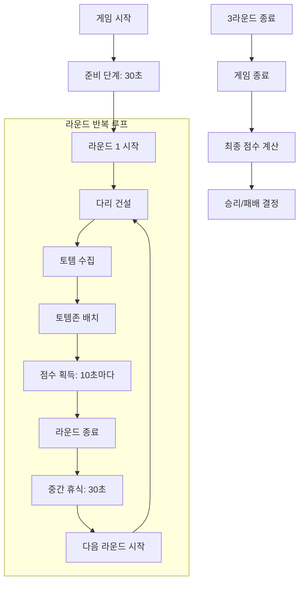

---

### 게임 UI 및 점수 시스템

| 게임 요소 | 설명 |
|----------|------|
| **화면 상단 UI** | 팀별 점수 및 타이머 실시간 표시 |
| **토템존 점수 시스템** | • 기본 토템존: 10초마다 점수 획득 • 중앙/위험 지역 토템존: 높은 점수 |
| **라운드 알림** | 화면 중앙에 라운드 시작/종료 알림 표시 |
| **카운트다운** | 게임 시작 및 라운드 종료 전 5초 카운트다운 |
| **최종 점수판** | 라운드별 점수, 누적 점수, 최종 순위 표시 |

---

### 팀 진행 전략

각 단계별 팀 전략적 고려사항:

**준비 단계**
- 직업 조합 최적화
- 초기 다리 건설 방향 결정
- 자원 분배 계획

**라운드 내 전술**
- 핵심 토템존 우선 점령
- 상대팀 방해 또는 자원 확보 전략
- 토템 획득과 방어 밸런스 조절

**후속 라운드 대비**
- 이전 라운드 분석을 통한 전략 조정
- 새 토템 유형 및 특별 규칙에 대응
- 자원 활용 최적화

---

### 개발자 참고사항

게임 진행은 초반의 단순한 메커니즘에서 점차 복잡한 전략적 선택으로 발전하도록 설계되었습니다. 준비 시간과 라운드 간 휴식 시간은 플레이어들이 협력 및 전략을 수립할 시간을 제공하며, 시각적/청각적 알림은 게임의 각 단계를 명확하게 구분하여 플레이어 경험을 향상시킵니다.

## 11. 제작이 필요한 요소 목록

### 11.1 모델링

| 카테고리 | 필요 에셋 |
| ----- | ----- |
| **플랫폼** | • 공용 플랫폼(중립 토템존) • A/B/C/D 팀 본진 플랫폼 |
| **연결 요소** | • 다릿줄 - 플랫폼 간 연결 요소 |
| **기본 아이템** | • 판자 - 다리 건설 자재 • 천막 - 시야 차단 구조물 • 토템 - 일반/골드/다이아몬드 토템 |
| **토템존** | • 팀 토템존 - 각 팀 색상별 • 중립 토템존 - 배율별 디자인(x2, x5) |
| **무기/도구** | • 총 - 팀 색상별 • 망원경 - 공통 아이템 |
| **기타 구조물** | • 리스폰 구역 - 팀 베이스, 전방 리스폰 • 생성 필드 - 판자, 총, 천막 생성 지점 |

### 11.2 UI

| 카테고리 | 필요 UI 요소 |
| ----- | ----- |
| **정보 표시** | • 상단 팀별 점수 및 라운드 정보 • 남은 시간 및 타이머 • 미니맵 및 팀원 위치 아이콘 • 인벤토리 및 소지 아이템 상태 |
| **기능성 UI** | • 망원경 줌 화면 • 천막 내구도 및 시간 표시 • 토템존 점유 UI • 건설 모드 전환 버튼 |
| **알림 UI** | • 라운드 전환 화면 • 승리/패배 결과 화면 • 카운트다운 UI (게임 시작, 라운드 전환) • 아이템 스폰 타이머 • 점수 획득 피드백 |
